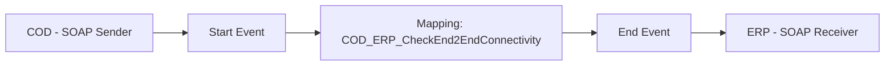

**iFlowId**: Check_Connectivity_to_SAP_Business_Suite_MMZ - **iFlowVersion**: 1.0

**Mermaid Diagram**

**Functional Summary**
**Brief description of the iFlow**
This iFlow performs an end-to-end connectivity check from SAP Cloud for Customer (COD) to SAP ERP via SAP Integration Suite.

**Involved systems with Adapters Type and Endpoint Type**
- COD: SOAP Adapter, EndpointSender
- ERP: SOAP Adapter, EndpointRecevier

**Key steps**
1. Receive a message from COD via SOAP.
2. Execute a mapping (COD_ERP_CheckEnd2EndConnectivity.opmap) to transform the message.
3. Send the transformed message to ERP via SOAP.

**Message transformation**
- Mapping: COD_ERP_CheckEnd2EndConnectivity.opmap

**Externalized parameters list and their descriptions**
- COD_enableBasicAuthentication_3: Enables basic authentication for COD.
- subject: Subject for COD.
- issuer: Issuer for COD.
- COD_address_2: Address for COD.
- COD_wsdlURL_1: WSDL URL for COD.
- Protocol-Hostname-Port: Protocol, Hostname and Port for ERP.
- Client: Client for ERP.
- ERP_proxyType_4: Proxy type for ERP.
- location-id: Location ID for ERP.
- ERP_authentication_5: Authentication method for ERP.
- artifactname: Credential name for ERP.
- ERP_allowChunking_3: Allows chunking for ERP.
- ERP_cleanupHeaders_2: Cleans up headers for ERP.
- p-key-alias: Private key alias for ERP.

**DataStore / JMS Dependency**
Not Found

**Cloud Connector Dependency**
Not Found

**Common Scripts Dependency**
Not Found

**ProcessDirect ComponentType Dependency**
Not Found