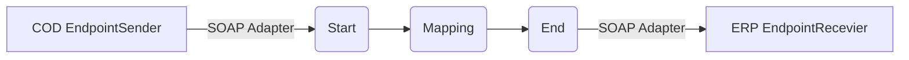

**iFlowId**: Check_Connectivity_to_SAP_Business_Suite_MMZ - **iFlowVersion**: 1.0

**Mermaid Diagram**

**Functional Summary**
- **Brief description of the iFlow**
  This iFlow performs an end-to-end connectivity check from SAP Cloud for Customer (COD) to SAP ERP via SAP Integration Suite.

- **Involved systems with Adapters Type and Endpoint Type**
  - COD (EndpointSender): SOAP Adapter
  - ERP (EndpointRecevier): SOAP Adapter

- **Key steps**
 1. Receive a message from COD via SOAP.
 2. Execute a mapping to transform the message (COD_ERP_CheckEnd2EndConnectivity).
 3. Send the transformed message to ERP via SOAP.

- **Message transformation**
  -  Mapping: COD_ERP_CheckEnd2EndConnectivity.opmap

- **Externalized parameters list, configured values and their descriptions**
  - ERP_authentication_5 = Client Certificate (Authentication method for ERP connection)
  - Protocol-Hostname-Port = https://erphost:443 (Protocol, Hostname, and Port for ERP connection)
  - subject = cn=subject (Subject for certificate)
  - artifactname =  (Credential Name)
  - p-key-alias =  (Private Key Alias)
  - ERP_allowChunking_3 = 1 (Allow Chunking)
  - issuer = cn=issuer (Issuer for certificate)
  - ERP_proxyType_4 = default (Proxy Type for ERP connection)
  - COD_enableBasicAuthentication_3 = true (Enable Basic Authentication for COD)
  - COD_wsdlURL_1 = /wsdl/CheckConnectivityConsumer.wsdl (WSDL URL for COD)
  - ERP_cleanupHeaders_2 = 1 (Cleanup Headers)
  - location-id =  (Location ID)
  - Client = 100 (Client for ERP connection)
  - COD_address_2 = /COD/ERP/SimpleConnect (Address for COD connection)

- **DataStore / JMS Dependency**
  Not Found

- **Cloud Connector Dependency**
  Not Found

- **Common Scripts Dependency**
  Not Found

- **ProcessDirect ComponentType Dependency**
  Not Found