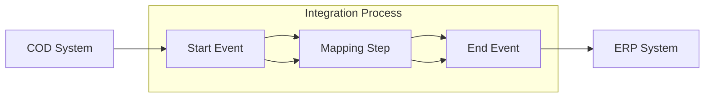

**iFlowId**: Check_Connectivity_to_SAP_Business_Suite_MMZ - **iFlowVersion**: 1.0.4

**Mermaid Diagram**

**Functional Summary**
- **Brief description of the iFlow**
This iFlow performs an end-to-end connectivity check from SAP Cloud for Customer (COD) to SAP ERP via SAP Integration Suite.

- **Involved systems with Adapters Type and Endpoint Type**
    - COD: SOAP Adapter, Endpoint Sender
    - ERP: SOAP Adapter, Endpoint Receiver

- **Key steps**
    1. Receive request from COD system via SOAP adapter.
    2. Perform a mapping step using the `COD_ERP_CheckEnd2EndConnectivity.opmap` mapping.
    3. Send the message to the ERP system via SOAP adapter.

- **Message transformation**
    - Message mapping is performed using the `COD_ERP_CheckEnd2EndConnectivity.opmap` operation mapping.

- **Externalized parameters list and their descriptions**
    - COD_enableBasicAuthentication_3: Enables basic authentication for COD.
    - subject: Subject for COD.
    - issuer: Issuer for COD.
    - COD_address_2: Address of the COD endpoint.
    - COD_wsdlURL_1: WSDL URL for the COD endpoint.
    - Protocol-Hostname-Port: Protocol, hostname and port of ERP system.
    - Client: Client for ERP.
    - ERP_proxyType_4: Proxy type for ERP.
    - location-id: Location ID for ERP.
    - ERP_authentication_5: Authentication method for ERP.
    - artifactname: Credential name for ERP.
    - ERP_allowChunking_3: Allows chunking for ERP.
    - ERP_cleanupHeaders_2: Cleans up headers for ERP.
    - p-key-alias: Private key alias.

- **DataStore / JMS Dependency**
Not Found

- **Cloud Connector Dependency**
Not Found

- **Common Scripts Dependency**
Not Found

- **ProcessDirect ComponentType Dependency**
Not Found