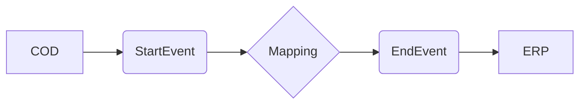

**iFlowId**: Check_Connectivity_to_SAP_Business_Suite_MMZ - **iFlowVersion**: 1.0

**Mermaid Diagram**

**Functional Summary**
**Brief description of the iFlow**
This iFlow performs an end-to-end connectivity check from SAP Cloud for Customer (C4C) to SAP ERP via SAP Integration Suite.

**Involved systems with Adapters Type and Endpoint Type**
- COD (SAP Cloud for Customer): SOAP Adapter, Endpoint Sender
- ERP (SAP ERP): SOAP Adapter, Endpoint Receiver

**Key steps**
1.  The iFlow is triggered by a message from C4C.
2.  The message is then processed by a mapping step.
3.  The mapped message is sent to SAP ERP.

**Message transformation**
- A mapping step `COD_ERP_CheckEnd2EndConnectivity` is used to transform the message between C4C and ERP.

**Externalized parameters list and their descriptions**
- COD_enableBasicAuthentication_3: Enables basic authentication for the C4C endpoint.
- subject: Subject for C4C endpoint.
- issuer: Issuer for C4C endpoint.
- COD_address_2: Address of the C4C endpoint.
- COD_wsdlURL_1: WSDL URL of the C4C endpoint.
- Protocol-Hostname-Port: Protocol, hostname, and port for the ERP endpoint.
- Client: Client for the ERP endpoint.
- ERP_proxyType_4: Proxy type for the ERP endpoint.
- location-id: Location ID for the ERP endpoint.
- ERP_authentication_5: Authentication method for the ERP endpoint.
- artifactname: Credential name for the ERP endpoint.
- ERP_allowChunking_3: Allows chunking for the ERP endpoint.
- ERP_cleanupHeaders_2: Cleans up headers for the ERP endpoint.
- p-key-alias: Private key alias for the ERP endpoint.

**DataStore / JMS Dependency**
Not Found

**Cloud Connector Dependency**
Not Found

**Common Scripts Dependency**
Not Found

**ProcessDirect ComponentType Dependency**
Not Found