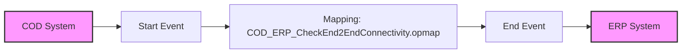

**iFlowId**: Check_Connectivity_to_SAP_Business_Suite_MMZ - **iFlowVersion**: 1.0.4

**Mermaid Diagram**

**Functional Summary**
**Brief description of the iFlow**
This iFlow performs an end-to-end connectivity check from SAP Cloud for Customer (COD) to SAP ERP via SAP Integration Suite.

**Involved systems with Adapters Type and Endpoint Type**

*   COD: SOAP, EndpointSender
*   ERP: SOAP, EndpointRecevier

**Key steps**

1.  The iFlow starts with a message from the COD system.
2.  A mapping step transforms the message using the `COD_ERP_CheckEnd2EndConnectivity.opmap` mapping.
3.  The transformed message is then sent to the ERP system.

**Message transformation**

*   Mapping is performed using `COD_ERP_CheckEnd2EndConnectivity.opmap`

**Externalized parameters list and their descriptions**

*   COD\_enableBasicAuthentication\_3: Enables basic authentication for COD.
*   subject: Subject for COD.
*   issuer: Issuer for COD.
*   COD\_address\_2: Address for COD.
*   COD\_wsdlURL\_1: WSDL URL for COD.
*   Protocol-Hostname-Port: Protocol, Hostname, and Port for ERP.
*   Client: Client for ERP.
*   ERP\_proxyType\_4: Proxy type for ERP.
*   location-id: Location ID for ERP.
*   ERP\_authentication\_5: Authentication type for ERP.
*   artifactname: Credential name for ERP.
*   ERP\_allowChunking\_3: Allow chunking for ERP.
*   ERP\_cleanupHeaders\_2: Cleanup headers for ERP.
*   p-key-alias: Private key alias.

**DataStore / JMS Dependency**
Not Found

**Cloud Connector Dependency**
Not Found

**Common Scripts Dependency**
Not Found

**ProcessDirect ComponentType Dependency**
Not Found