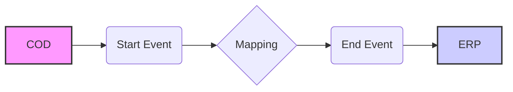

**iFlowId**: Check_Connectivity_to_SAP_Business_Suite_MMZ - **iFlowVersion**: 1.0.4

**Mermaid Diagram**

**Functional Summary**
**Brief description of the iFlow**
This iFlow performs an end-to-end connectivity check from SAP Cloud for Customer (COD) to SAP ERP via SAP Integration Suite (HCI).

**Involved systems with Adapters Type and Endpoint Type**
- COD: SOAP Adapter, Endpoint Sender
- ERP: SOAP Adapter, Endpoint Receiver

**Key steps**
1.  The iFlow starts with a message received from the COD system via SOAP.
2.  A mapping step transforms the message using the `COD_ERP_CheckEnd2EndConnectivity.opmap` mapping.
3.  The transformed message is sent to the ERP system via SOAP.

**Message transformation**
-   The iFlow uses a mapping named `COD_ERP_CheckEnd2EndConnectivity` located at `dir://opmap/src/main/resources/mapping/COD_ERP_CheckEnd2EndConnectivity.opmap`.

**Externalized parameters list and their descriptions**
-   `COD_enableBasicAuthentication_3`: Enables basic authentication for the COD sender adapter.
-   `subject`: Subject for COD sender.
-   `issuer`: Issuer for COD sender.
-   `COD_address_2`: Address of the COD endpoint.
-   `COD_wsdlURL_1`: WSDL URL of the COD endpoint.
-   `Protocol-Hostname-Port`: Protocol, hostname, and port of the ERP endpoint.
-   `Client`: Client for the ERP endpoint.
-   `ERP_proxyType_4`: Proxy type for the ERP receiver adapter.
-   `location-id`: Location ID for the ERP receiver adapter.
-   `ERP_authentication_5`: Authentication method for the ERP receiver adapter.
-   `artifactname`: Credential name for the ERP receiver adapter.
-   `ERP_allowChunking_3`: Allows chunking for the ERP receiver adapter.
-   `ERP_cleanupHeaders_2`: Cleans up headers for the ERP receiver adapter.
-   `p-key-alias`: Private Key Alias.

**DataStore / JMS Dependency**
Not Found

**Cloud Connector Dependency**
Not Found

**Common Scripts Dependency**
Not Found

**ProcessDirect ComponentType Dependency**
Not Found