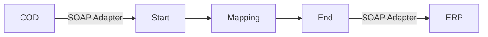

**iFlowId**: Check_Connectivity_to_SAP_Business_Suite_MMZ - **iFlowVersion**: 1.0.4

**Mermaid Diagram**

**BPMN Diagram**

**Functional Summary**
- **Brief description of the iFlow**
  This iFlow performs an end-to-end connectivity check from SAP Cloud for Customer (COD) to SAP ERP via SAP Integration Suite.

- **Involved systems with Adapters Type and Endpoint Type**
  - COD (EndpointSender): SOAP Adapter
  - ERP (EndpointRecevier): SOAP Adapter

- **Key steps**
  1. The iFlow starts with a SOAP call from COD.
  2. The message is passed to a mapping step (`COD_ERP_CheckEnd2EndConnectivity.opmap`).
  3. The mapped message is then sent to ERP via a SOAP call.

- **Message transformation**
  - The iFlow uses a mapping step (`COD_ERP_CheckEnd2EndConnectivity.opmap`) to transform the message between COD and ERP.

- **Externalized parameters list, configured values and their descriptions**
  - `ERP_authentication_5`: Client Certificate (Authentication type for ERP connection)
  - `Protocol-Hostname-Port`: `https://erphost:443` (ERP Hostname and Port)
  - `subject`: `cn=subject` (Subject for client certificate authentication)
  - `artifactname`:  (Credential Name)
  - `p-key-alias`:  (Private Key Alias for Client Certificate)
  - `ERP_allowChunking_3`: 1 (Allow Chunking for ERP Connection)
  - `issuer`: `cn=issuer` (Issuer for client certificate authentication)
  - `ERP_proxyType_4`: default (Proxy Type for ERP Connection)
  - `COD_enableBasicAuthentication_3`: true (Enable Basic Authentication for COD Connection)
  - `COD_wsdlURL_1`: `/wsdl/CheckConnectivityConsumer.wsdl` (WSDL URL for COD Connection)
  - `ERP_cleanupHeaders_2`: 1 (Cleanup Headers for ERP Connection)
  - `location-id`:  (Location ID)
  - `Client`: 100 (SAP Client for ERP Connection)
  - `COD_address_2`: `/COD/ERP/SimpleConnect` (Address for COD Connection)

- **DataStore / JMS Dependency**
  Not Found

- **Cloud Connector Dependency**
  Not Found

- **Common Scripts Dependency**
  Not Found

- **ProcessDirect ComponentType Dependency**
  Not Found