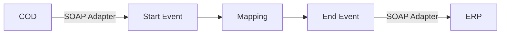

**iFlowId**: Check_Connectivity_to_SAP_Business_Suite_MMZ - **iFlowVersion**: 1.0.4

**Mermaid Diagram**

**BPMN Diagram**

**Functional Summary**
-   **Brief description of the iFlow**
    This iFlow performs an end-to-end connectivity check from SAP Cloud for Customer (COD) to SAP ERP via SAP Integration Suite.

-   **Involved systems with Adapters Type and Endpoint Type**
    -   COD: SOAP, EndpointSender
    -   ERP: SOAP, EndpointRecevier

-   **Key steps**
    1.  Receive request from COD via SOAP adapter.
    2.  Map the input message using a mapping step (COD_ERP_CheckEnd2EndConnectivity.opmap).
    3.  Send the message to ERP via SOAP adapter.

-   **Message transformation**
    -   Mapping: COD_ERP_CheckEnd2EndConnectivity.opmap

-   **Externalized parameters list, configured values and their descriptions**
    -   COD\_enableBasicAuthentication\_3 = true
    -   COD\_wsdlURL\_1 = /wsdl/CheckConnectivityConsumer.wsdl
    -   COD\_address\_2 = /COD/ERP/SimpleConnect
    -   ERP\_authentication\_5 = Client Certificate
    -   Protocol-Hostname-Port = https\://erphost\:443
    -   subject = cn\=subject
    -   artifactname = *empty*
    -   p-key-alias = *empty*
    -   ERP\_allowChunking\_3 = 1
    -   issuer = cn\=issuer
    -   ERP\_proxyType\_4 = default
    -   ERP\_cleanupHeaders\_2 = 1
    -   location-id = *empty*
    -   Client = 100

-   **DataStore / JMS Dependency**
    Not Found

-   **Cloud Connector Dependency**
    Not Found

-   **Common Scripts Dependency**
    Not Found

-   **ProcessDirect ComponentType Dependency**
    Not Found