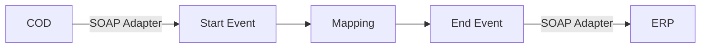

**iFlowId**: Check_Connectivity_to_SAP_Business_Suite_MMZ - **iFlowVersion**: 1.0

**Mermaid Diagram**

**BPMN Diagram**

**Functional Summary**
- **Brief description of the iFlow**
  This iFlow performs an end-to-end connectivity check from SAP Cloud for Customer (COD) to SAP ERP via SAP Integration Suite.

- **Involved systems with Adapters Type and Endpoint Type**
  - COD: SOAP, EndpointSender
  - ERP: SOAP, EndpointRecevier

- **Key steps**
 1. Receive SOAP request from COD.
 2. Execute a mapping (COD_ERP_CheckEnd2EndConnectivity.opmap).
 3. Send a SOAP request to ERP.

- **Message transformation**
  - Mapping: COD_ERP_CheckEnd2EndConnectivity.opmap

- **Externalized parameters list, configured values and their descriptions**
  - COD_address_2: /COD/ERP/SimpleConnect (Address for the COD endpoint)
  - COD_wsdlURL_1: /wsdl/CheckConnectivityConsumer.wsdl (WSDL URL for the COD endpoint)
  - COD_enableBasicAuthentication_3: true (Enables Basic Authentication for COD)
  - ERP_proxyType_4: default (Proxy Type for ERP)
  - ERP_allowChunking_3: 1 (Allows chunking for ERP)
  - ERP_cleanupHeaders_2: 1 (Cleans up headers for ERP)
  - ERP_authentication_5: Client Certificate (Authentication method for ERP)
  - Protocol-Hostname-Port: https://erphost:443 (Protocol, Hostname, and Port for the ERP system)
  - Client: 100 (Client ID for ERP)
  - artifactname: (Credential Name)
  - p-key-alias: (Private Key Alias)
  - location-id: (Location ID)
  - subject: cn=subject (Subject)
  - issuer: cn=issuer (Issuer)

- **DataStore / JMS Dependency**
  Not Found

- **Cloud Connector Dependency**
  Not Found

- **Common Scripts Dependency**
  Not Found

- **ProcessDirect ComponentType Dependency**
  Not Found