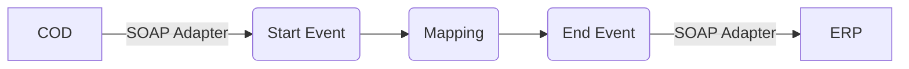

**iFlowId**: Check_Connectivity_to_SAP_Business_Suite_MMZ - **iFlowVersion**: 1.0

**Mermaid Diagram**

**BPMN Diagram**

**Functional Summary**
-   **Brief description of the iFlow**
    This iFlow performs an end-to-end connectivity check from SAP Cloud for Customer (COD) to SAP ERP via SAP Integration Suite.

-   **Involved systems with Adapters Type and Endpoint Type**
    -   COD (EndpointSender): SOAP Adapter
    -   ERP (EndpointRecevier): SOAP Adapter

-   **Key steps**

    1.  The iFlow receives a message from COD via the SOAP adapter.
    2.  A mapping step (COD\_ERP\_CheckEnd2EndConnectivity.opmap) transforms the message.
    3.  The transformed message is sent to ERP via the SOAP adapter.

-   **Message transformation**
    -   COD\_ERP\_CheckEnd2EndConnectivity.opmap

-   **Externalized parameters list, configured values and their descriptions**

    -   COD\_address\_2: /COD/ERP/SimpleConnect (Address for COD endpoint)
    -   COD\_wsdlURL\_1: /wsdl/CheckConnectivityConsumer.wsdl (WSDL URL for COD endpoint)
    -   COD\_enableBasicAuthentication\_3: true (Enable Basic Authentication for COD endpoint)
    -   ERP\_allowChunking\_3: 1 (Allow Chunking for ERP endpoint)
    -   ERP\_authentication\_5: Client Certificate (Authentication Type for ERP endpoint)
    -   ERP\_cleanupHeaders\_2: 1 (Cleanup Headers for ERP endpoint)
    -   ERP\_proxyType\_4: default (Proxy Type for ERP endpoint)
    -   Protocol-Hostname-Port: https\://erphost\:443 (Protocol, Hostname and Port for ERP endpoint)
    -   Client: 100 (Client for ERP endpoint)
    -   location-id:  (Location ID for ERP endpoint)
    -   artifactname:  (Credential Name for ERP endpoint)
    -   p-key-alias:  (Private Key Alias for ERP endpoint)
    -   issuer: cn\=issuer (Issuer for COD endpoint)
    -   subject: cn\=subject (Subject for COD endpoint)

-   **DataStore / JMS Dependency**
    Not Found

-   **Cloud Connector Dependency**
    Not Found

-   **Common Scripts Dependency**
    Not Found

-   **ProcessDirect ComponentType Dependency**
    Not Found