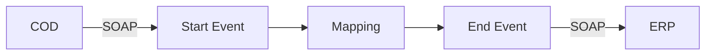

**iFlowId**: Check_Connectivity_to_SAP_Business_Suite_MMZ - **iFlowVersion**: 1.0.5

**Mermaid Diagram**

**BPMN Diagram**

**Functional Summary**
-   **Brief description of the iFlow**
    Perform End2End connectivity check from SAP Cloud for Customer to SAP ERP via HCI.

-   **Involved systems with Adapters Type and Endpoint Type**
    -   COD (SOAP, EndpointSender)
    -   ERP (SOAP, EndpointRecevier)

-   **Key steps**
    1.  The iFlow starts with a SOAP call from COD.
    2.  A mapping step transforms the message.
    3.  The transformed message is sent to ERP via SOAP.

-   **Message transformation**
    -   Mapping: COD\_ERP\_CheckEnd2EndConnectivity

-   **Externalized parameters list, configured values and their descriptions**
    -   COD\_wsdlURL\_1: /wsdl/CheckConnectivityConsumer.wsdl
    -   COD\_address\_2: /COD/ERP/SimpleConnect
    -   COD\_enableBasicAuthentication\_3: true
    -   ERP\_authentication\_5: Client Certificate
    -   ERP\_proxyType\_4: default
    -   ERP\_allowChunking\_3: 1
    -   ERP\_cleanupHeaders\_2: 1
    -   Protocol-Hostname-Port: https\://erphost\:443
    -   Client: 100
    -   location-id:
    -   artifactname:
    -   p-key-alias:
    -   subject: cn\=subject
    -   issuer: cn\=issuer

-   **DataStore / JMS Dependency**
    Not Found

-   **Cloud Connector Dependency**
    Not Found

-   **Common Scripts Dependency**
    Not Found

-   **ProcessDirect ComponentType Dependency**
    Not Found