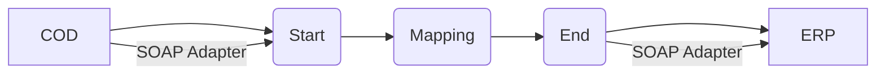

**iFlowId**: Check_Connectivity_to_SAP_Business_Suite_MMZ - **iFlowVersion**: 1.0.5

**Mermaid Diagram**

**BPMN Diagram**

**Functional Summary**
- **Brief description of the iFlow**
  Performs an end-to-end connectivity check from SAP Cloud for Customer (COD) to SAP ERP via SAP Integration Suite.

- **Involved systems with Adapters Type and Endpoint Type**
    - COD (Cloud for Customer) - SOAP Adapter - Endpoint Sender
    - ERP (SAP Business Suite) - SOAP Adapter - Endpoint Receiver

- **Key steps**
    1. The iFlow starts with a SOAP call from COD.
    2. The message is mapped using a mapping step.
    3. The iFlow ends with a SOAP call to ERP.

- **Message transformation**
    - A mapping step named "COD_ERP_CheckEnd2EndConnectivity" is used. The mapping file is located at `dir://opmap/src/main/resources/mapping/COD_ERP_CheckEnd2EndConnectivity.opmap`.

- **Externalized parameters list, configured values and their descriptions**
    - `ERP_authentication_5`: Client Certificate
    - `Protocol-Hostname-Port`: https://erphost:443
    - `subject`: cn=subject
    - `artifactname`: (empty)
    - `p-key-alias`: (empty)
    - `ERP_allowChunking_3`: 1
    - `issuer`: cn=issuer
    - `ERP_proxyType_4`: default
    - `COD_enableBasicAuthentication_3`: true
    - `COD_wsdlURL_1`: /wsdl/CheckConnectivityConsumer.wsdl
    - `ERP_cleanupHeaders_2`: 1
    - `location-id`: (empty)
    - `Client`: 100
    - `COD_address_2`: /COD/ERP/SimpleConnect

- **DataStore / JMS Dependency**
  Not Found

- **Cloud Connector Dependency**
  Not Found

- **Common Scripts Dependency**
  Not Found

- **ProcessDirect ComponentType Dependency**
  Not Found