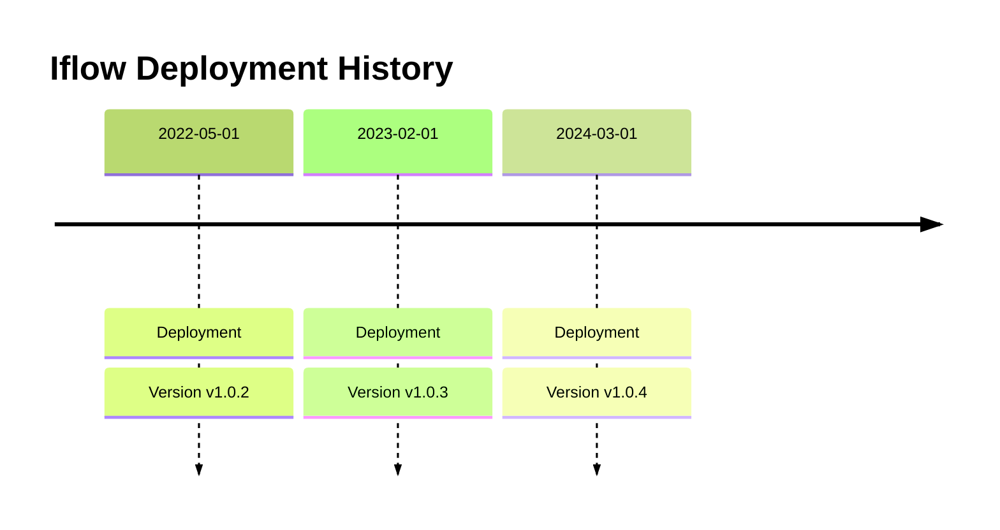

**SAP Cloud Integration Package:** `MMZ - Cell Iflows`

This package contains the following integration flows:
<!-- IFLOW_TABLE_START -->
| iFlow ID      | Version | Sender        | Receiver      | Description                        | Details Link |
| ------------- | ------- | ------------- | ------------- | ---------------------------------- | ------------ |
| SEDA_Model_-_Single_Queue_-_Restart_and_Discard_MMZ | 1.0.1 | Postman | Dummy | Demo SEDA Iflow with JMS | [View Details](SEDA_Model_-_Single_Queue_-_Restart_and_Discard_MMZ-1.0.1/readme.md) |
| SEDA_Model_-_Single_DS_-_Restart_and_Discard_MMZ | 1.0.1 | Postman | Dummy | Demo SEDA Iflow with DS | [View Details](SEDA_Model_-_Single_DS_-_Restart_and_Discard_MMZ-1.0.1/readme.md) |
| Check_Connectivity_to_SAP_Business_Suite_MMZ | 1.0.4 | SAPCloudforCustomer | SAPERP | Check Connectivity with SAP Business Suite | [View Details](Check_Connectivity_to_SAP_Business_Suite_MMZ-1.0.4/readme.md) |
| Check_Connectivity_from_SAP_Business_Suite_MMZ | 1.0.3 | SAPERP | SAPCloudforCustomer | Check Connectivity with SAP Business Suite | [View Details](Check_Connectivity_from_SAP_Business_Suite_MMZ-1.0.3/readme.md) |
<!-- IFLOW_TABLE_END -->

