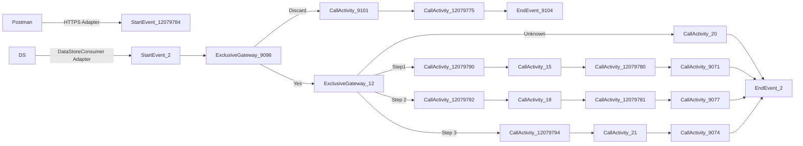

**iFlowId**: SEDA_Model_-_Single_DS_-_Restart_and_Discard_MMZ - **iFlowVersion**: 1.0.0

**Mermaid Diagram**

**Functional Summary**
-   **Brief description of the iFlow**
    This iFlow demonstrates a SEDA (Staged Event-Driven Architecture) model for asynchronous message processing using a Data Store. It receives messages, processes them in multiple steps, and handles potential exceptions. The iFlow also incorporates retry and discard mechanisms based on the `SAP_DataStoreRetries` header.

-   **Involved systems with Adapters Type and Endpoint Type**
    -   Postman (HTTPS Sender)
    -   DS (DataStoreConsumer Sender)

-   **Key steps**
    1.  Receive message via HTTPS or DataStore.
    2.  Determine if the message should be reprocessed, or discarded based on the number of retries. If the message should be discarded, log the discarded message and end.
    3.  Route the message to different processing steps (Step1, Step2, Step3) based on the `Step` header. Each step puts the message in DataStore again.
    4.  Each processing step (Step1, Step2, Step3) calls a sub-process to enrich the message, log custom status, and handle exceptions. If there is an exception, log the async exception and end the step.
    5.  After each processing step, log a custom status with the message type and step completion.
    6.  If the "Step" header value is unknown, log an UnknownStep status.

-   **Message transformation**
    -   The iFlow uses enrichers to set headers like `SAP_Sender`, `SAP_Receiver`, `SAP_MessageType`, and `Step`.
    -   Custom Status enrichers create `SAP_MessageProcessingLogCustomStatus` entries with dynamic values derived from headers.
    -   Groovy scripts are used for logging exceptions and discarded messages.

-   **Externalized parameters list and their descriptions**
    -   `RoleName`: User role for HTTPS sender authorization.
    -   `Maximum Retry Interval`: Maximum retry interval for DataStore consumer.
    -   `Exponential Backoff`: Flag for exponential backoff in DataStore consumer.
    -   `Data Store Name`: Name of the Data Store used for persistence.
    -   `Poll Interval`: Polling interval for the DataStore consumer.
    -   `Retry Interval`: Retry interval for the DataStore consumer.
    -   `Lock Timeout`: Lock timeout for the DataStore consumer.
    -   `Retention Threshold 4 Alerting`: Retention threshold for alerting in DataStore.
    -   `Expiration Period`: Expiration period for data in DataStore.
    -   `MaxRetries`: Maximum retries before discarding message.

-   **DataStore / JMS Dependency**
    Yes

-   **Cloud Connector Dependency**
    Not Found

-   **Common Scripts Dependency**
    -   Log_Discarded_Message.groovy, scriptBundleId: Groovy_Logging_Scripts
    -   Log_Exception_Async.groovy, scriptBundleId: Groovy_Logging_Scripts

-   **ProcessDirect ComponentType Dependency**
    Not Found