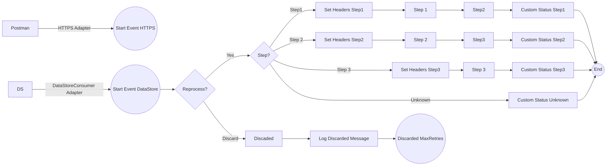

markdown
**iFlowId**: SEDA_Model_-_Single_DS_-_Restart_and_Discard_MMZ - **iFlowVersion**: 1.0.0

**Mermaid Diagram**

```

**Functional Summary**
- **Brief description of the iFlow**
This iFlow processes messages retrieved from a Data Store, routes them based on the 'Step' header, and stores them back into the Data Store after each step. It includes error handling and a mechanism to discard messages that exceed a maximum retry count. The flow is initiated either by an HTTPS call or by consuming messages from a Data Store.

- **Involved systems with Adapters Type and Endpoint Type**
    - Postman - HTTPS - EndpointSender
    - DS - DataStoreConsumer - EndpointSender

- **Key steps**
 1. Receive message via HTTPS or DataStore Consumer.
 2. Check if the message should be reprocessed based on retry count. If the retry count exceeds the maximum, discard the message.
 3. Route the message based on the 'Step' header to different processing steps (Step1, Step2, Step3).
 4. Each step prepares the message, calls a local integration process, and stores the message back into the Data Store.
 5. Set custom status in message processing log after each step.
 6. Log exceptions asynchronously.

- **Message transformation**
    - The iFlow uses Enrichers to set headers (SAP_Sender, SAP_Receiver, SAP_MessageType, Step) with constant values.
    - Custom Status enrichers create SAP_MessageProcessingLogCustomStatus headers with expression values.
    - Step 2 and Step 1 prepare the message using enrichers to set the Step header and wrap the message content.

- **Externalized parameters list and their descriptions**
    - RoleName: User role for HTTPS sender authentication.
    - Maximum Retry Interval: Maximum interval between retries for DataStore Consumer.
    - Exponential Backoff: Flag to enable exponential backoff for DataStore Consumer retries.
    - Data Store Name: Name of the Data Store used for message persistence.
    - Poll Interval: Interval for polling messages from the Data Store.
    - Retry Interval: Interval between retries for DataStore Consumer.
    - Lock Timeout: Timeout for file lock in DataStore Consumer.
    - Retention Threshold 4 Alerting: Retention threshold for alerting in DB storage.
    - Expiration Period: Expiration period for messages in DB storage.
    - MaxRetries: Maximum number of retries before discarding a message.

- **DataStore / JMS Dependency**
Yes

- **Cloud Connector Dependency**
Not Found

- **Common Scripts Dependency**
    - Groovy_Logging_Scripts

- **ProcessDirect ComponentType Dependency**
Not Found