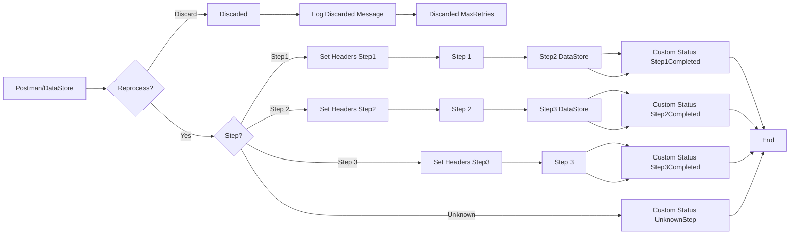

**iFlowId**: SEDA_Model_-_Single_DS_-_Restart_and_Discard_MMZ - **iFlowVersion**: 1.0.0

**Mermaid Diagram**

**Functional Summary**
- **Brief description of the iFlow**
  This iFlow processes messages retrieved from a DataStore, routes them through a series of steps (Step 1, Step 2, Step 3) based on the 'Step' header, and handles exceptions by logging them. It includes retry logic and discards messages that exceed the maximum retry attempts. The iFlow is triggered either by an HTTPS call or by the DataStore consumer.

- **Involved systems with Adapters Type and Endpoint Type**
  - Postman - Adapter Type: HTTPS - Endpoint Type: Sender
  - DS - Adapter Type: DataStoreConsumer - Endpoint Type: Sender

- **Key steps**
  1.  Receive message via HTTPS or DataStore.
  2.  Set initial headers (SAP_Sender, SAP_Receiver, SAP_MessageType, Step).
  3.  Store the message in the DataStore (Step1).
  4.  Route the message based on the 'Step' header value (Step1, Step2, Step3, or Unknown).
  5.  For each step (Step1, Step2, Step3):
        - Prepare the step by setting the 'Step' header and message content.
        - Call a local integration process for the step.
        - Store the message in the DataStore (Step2, Step3).
        - Set a custom status in the message processing log.
  6.  If the message exceeds the maximum retry attempts, discard it and log the event.
  7.  Log any exceptions that occur during processing.
  8.  End the iFlow.

- **Message transformation**
  - Enricher components are used to set headers (SAP_Sender, SAP_Receiver, SAP_MessageType, Step, SAP_MessageProcessingLogCustomStatus) with constant values or expressions.
  - The "Prepare Step" activities (Prepare Step 2, Prepare Step 3) add a header and wrap the message content in an XML envelope.

- **Externalized parameters list and their descriptions**
  - `{{RoleName}}`: Role required to access the HTTPS endpoint.
  - `{{Maximum Retry Interval}}`: Maximum retry interval for the DataStore consumer.
  - `{{Exponential Backoff}}`: Flag to enable exponential backoff for the DataStore consumer.
  - `{{Data Store Name}}`: Name of the DataStore used for persistence.
  - `{{Poll Interval}}`: Poll interval for the DataStore consumer.
  - `{{Retry Interval}}`: Retry interval for the DataStore consumer.
  - `{{Lock Timeout}}`: Lock timeout for the DataStore consumer.
  - `{{Retention Threshold 4 Alerting}}`: Retention threshold for alerting in the DataStore.
  - `{{Expiration Period}}`: Expiration period for messages in the DataStore.
  - `{{MaxRetries}}`: Maximum number of retries before discarding the message.

- **DataStore / JMS Dependency**
  Yes

- **Cloud Connector Dependency**
  Not Found

- **Common Scripts Dependency**
  - Log_Discarded_Message.groovy
  - Log_Exception_Async.groovy
  - script1.groovy

- **ProcessDirect ComponentType Dependency**
  Not Found