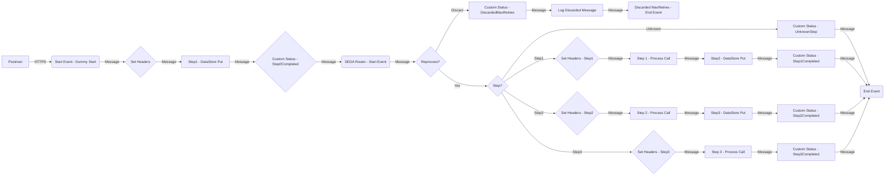

**iFlowId**: SEDA_Model_-_Single_DS_-_Restart_and_Discard_MMZ - **iFlowVersion**: 1.0.0

**Mermaid Diagram**

**Functional Summary**
- **Brief description of the iFlow**
This iFlow processes messages asynchronously using a SEDA (Staged Event-Driven Architecture) router. It receives messages, persists them in a Data Store, and then processes them in a series of steps. The iFlow includes error handling and a mechanism to discard messages that exceed a maximum retry count.

- **Involved systems with Adapters Type and Endpoint Type**
    - Postman - HTTPS - EndpointSender
    - DS - DataStoreConsumer - EndpointSender

- **Key steps**
    1. Receive message via HTTPS.
    2. Set initial headers.
    3. Store the message in a Data Store (Step1).
    4. Route the message based on the 'Step' header.
    5. Process steps 1, 2, and 3 by calling local integration processes.
    6. Store the message in a Data Store (Step2, Step3).
    7. Update message processing log with custom status.
    8. If max retries are exceeded, discard the message and log it.

- **Message transformation**
    - The iFlow uses Enrichers to set headers and custom status.
    - Groovy scripts are used for logging exceptions and discarded messages.
    - Step 2 and Step 1 processes use Enrichers to prepare the message for subsequent steps by setting the 'Step' header and message content.

- **Externalized parameters list and their descriptions**
    - RoleName: Role required to access the HTTPS endpoint.
    - Maximum Retry Interval: Maximum time interval for retries.
    - Exponential Backoff: Flag to enable exponential backoff for retries.
    - Data Store Name: Name of the Data Store used for persistence.
    - Poll Interval: Interval for polling the Data Store.
    - Retry Interval: Interval between retry attempts.
    - Lock Timeout: Timeout for file locking.
    - Retention Threshold 4 Alerting: Threshold for alerting on retention.
    - Expiration Period: Time period after which messages expire.
    - MaxRetries: Maximum number of retries before discarding a message.

- **DataStore / JMS Dependency**
Yes

- **Cloud Connector Dependency**
Not Found

- **Common Scripts Dependency**
List of scripts: Log_Discarded_Message.groovy, Log_Exception_Async.groovy, script1.groovy

- **ProcessDirect ComponentType Dependency**
Not Found