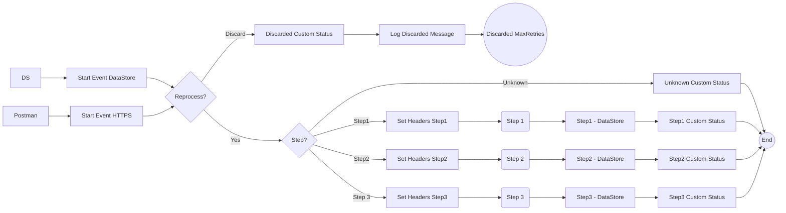

**iFlowId**: SEDA_Model_-_Single_DS_-_Restart_and_Discard_MMZ - **iFlowVersion**: 1.0.0

**Mermaid Diagram**

**Functional Summary**
- **Brief description of the iFlow**
This iFlow processes messages retrieved from a DataStore, routes them through a series of steps (Step 1, Step 2, Step 3), and then stores the messages back into the DataStore after each step. It includes error handling and a mechanism to discard messages that exceed a maximum retry count. The iFlow is triggered either by an HTTPS call or by the DataStore Consumer.

- **Involved systems with Adapters Type and Endpoint Type**
    - Postman - HTTPS - EndpointSender
    - DS - DataStoreConsumer - EndpointSender

- **Key steps**
    1.  Receive message via HTTPS or DataStore Consumer.
    2.  Determine if the message should be reprocessed based on retry count. If the retry count exceeds the maximum, the message is discarded.
    3.  Route the message to Step 1, Step 2, or Step 3 based on the `Step` header.
    4.  Each step enriches the message and stores it back into the DataStore.
    5.  If an exception occurs during any step, log the exception and set a custom status.

- **Message transformation**
    - The iFlow uses Enrichers to set headers and custom status messages.
    - Groovy scripts are used for logging and potentially for throwing exceptions.
    - The "Prepare Step" call activities add a "Step" header with the next step to be executed.
    - The "Set Headers" call activities set the SAP_Sender, SAP_Receiver and SAP_MessageType headers.

- **Externalized parameters list and their descriptions**
    - `RoleName`: Role required to access the HTTPS endpoint.
    - `Maximum Retry Interval`: Maximum interval for retries when consuming from the DataStore.
    - `Exponential Backoff`: Flag to enable exponential backoff for DataStore retries.
    - `Data Store Name`: Name of the DataStore used for message persistence.
    - `Poll Interval`: Interval for polling the DataStore.
    - `Retry Interval`: Interval between retries for DataStore consumption.
    - `Lock Timeout`: Timeout for file lock when accessing the DataStore.
    - `Retention Threshold 4 Alerting`: Retention threshold for alerting on DataStore.
    - `Expiration Period`: Expiration period for messages in the DataStore.
    - `MaxRetries`: Maximum number of retries before discarding a message.

- **DataStore / JMS Dependency**
Yes

- **Cloud Connector Dependency**
Not Found

- **Common Scripts Dependency**
    - Log_Discarded_Message.groovy - Groovy_Logging_Scripts
    - Log_Exception_Async.groovy - Groovy_Logging_Scripts

- **ProcessDirect ComponentType Dependency**
Not Found