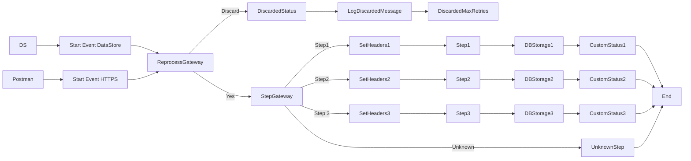

**iFlowId**: SEDA_Model_-_Single_DS_-_Restart_and_Discard_MMZ - **iFlowVersion**: 1.0.0

**Mermaid Diagram**

**Functional Summary**
- **Brief description of the iFlow**
  This iFlow demonstrates a SEDA (Staged Event-Driven Architecture) model with a single Data Store, restart, and discard mechanism. It receives messages either via HTTPS or from a Data Store, processes them through a series of steps (Step 1, Step 2, Step 3), and stores the messages in a Data Store at each step. It includes exception handling and logging. The iFlow also includes a retry mechanism and discards messages that exceed the maximum retry limit.

- **Involved systems with Adapters Type and Endpoint Type**
    - Postman - HTTPS - EndpointSender
    - DS - DataStoreConsumer - EndpointSender

- **Key steps**
    1. Receive message via HTTPS or DataStore.
    2. Determine if the message should be reprocessed based on retry count. If the retry count exceeds the maximum, the message is discarded.
    3. Route the message to Step 1, Step 2, or Step 3 based on the `Step` header.
    4. Each step (Step 1, Step 2, Step 3) prepares the message, calls a local integration process, and stores the message in a Data Store.
    5. Custom statuses are set to track the progress of each step.
    6. Exceptions are caught and logged asynchronously.
    7. Completed messages are terminated.

- **Message transformation**
    - The iFlow uses Enrichers to set headers and custom statuses.
    - Groovy scripts are used for logging and exception handling.
    - Each step prepares the message by setting the `Step` header and wrapping the message content.

- **Externalized parameters list and their descriptions**
    - `RoleName`: Role required to access the HTTPS endpoint.
    - `Maximum Retry Interval`: Maximum retry interval for DataStore Consumer.
    - `Exponential Backoff`: Flag to enable exponential backoff for DataStore Consumer.
    - `Data Store Name`: Name of the Data Store used for persistence.
    - `Poll Interval`: Poll interval for DataStore Consumer.
    - `Retry Interval`: Retry interval for DataStore Consumer.
    - `Lock Timeout`: Lock timeout for DataStore Consumer.
    - `Retention Threshold 4 Alerting`: Retention threshold for alerting in DataStore.
    - `Expiration Period`: Expiration period for DataStore entries.
    - `MaxRetries`: Maximum number of retries before discarding the message.

- **DataStore / JMS Dependency**
    Yes

- **Cloud Connector Dependency**
    Not Found

- **Common Scripts Dependency**
    - Log_Discarded_Message.groovy - Groovy_Logging_Scripts
    - Log_Exception_Async.groovy - Groovy_Logging_Scripts

- **ProcessDirect ComponentType Dependency**
    Not Found