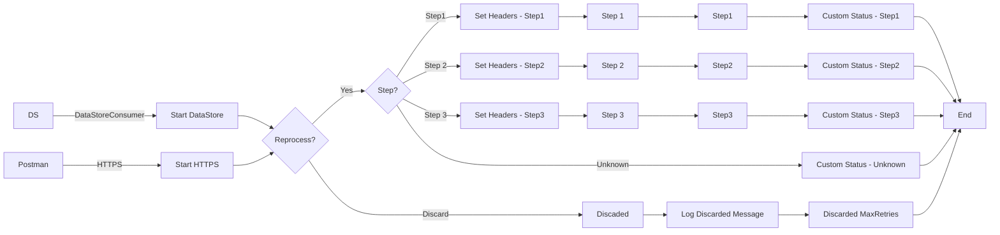

markdown
**iFlowId**: SEDA_Model_-_Single_DS_-_Restart_and_Discard_MMZ - **iFlowVersion**: 1.0.0

**Mermaid Diagram**

```

**Functional Summary**
- **Brief description of the iFlow**
This iFlow processes messages retrieved from a Data Store, routes them based on the 'Step' header, and stores them back in the Data Store after each step. It includes error handling and a mechanism to discard messages that exceed a maximum retry count.

- **Involved systems with Adapters Type and Endpoint Type**
    - Postman - HTTPS - Sender
    - DS - DataStoreConsumer - Sender

- **Key steps**
 1. Receives message from HTTPS endpoint or DataStore.
 2. Checks if the message should be reprocessed based on retry count. If retry count exceeds the maximum, the message is discarded.
 3. Routes the message based on the value of the 'Step' header (Step1, Step2, Step3, or Unknown).
 4. For each step (Step1, Step2, Step3), the iFlow calls a local integration process to prepare the message, then stores the message in the Data Store.
 5. Sets a custom status in the message processing log after each step.
 6. If the step is unknown, sets a custom status and ends the flow.
 7. Logs any exceptions that occur during the process.

- **Message transformation**
    - The iFlow uses Enrichers to set headers (SAP_Sender, SAP_Receiver, SAP_MessageType, Step) with constant values.
    - The iFlow uses Enrichers to set custom status messages in the message processing log using expressions.
    - Step 2 and Step 1 local integration processes use Enrichers to prepare the message with a constant body and header.

- **Externalized parameters list and their descriptions**
    - RoleName: User role for HTTPS sender authentication.
    - Maximum Retry Interval: Maximum interval for retries.
    - Exponential Backoff: Flag to enable exponential backoff for retries.
    - Data Store Name: Name of the Data Store.
    - Poll Interval: Interval for polling the Data Store.
    - Retry Interval: Interval for retries.
    - Lock Timeout: Timeout for file lock.
    - Retention Threshold 4 Alerting: Retention threshold for alerting.
    - Expiration Period: Expiration period for data in the Data Store.
    - MaxRetries: Maximum number of retries before discarding a message.

- **DataStore / JMS Dependency**
Yes

- **Cloud Connector Dependency**
Not Found

- **Common Scripts Dependency**
    - Groovy_Logging_Scripts

- **ProcessDirect ComponentType Dependency**
Not Found