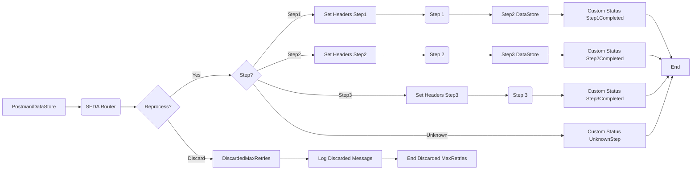

**iFlowId**: SEDA_Model_-_Single_DS_-_Restart_and_Discard_MMZ - **iFlowVersion**: 1.0.0

**Mermaid Diagram**

**Functional Summary**
- **Brief description of the iFlow**
  This iFlow demonstrates a SEDA (Staged Event-Driven Architecture) model for processing messages from a Data Store. It includes steps for processing the message, handling exceptions, and discarding messages that exceed the maximum retry attempts. The flow involves multiple integration processes for modularity and reusability.

- **Involved systems with Adapters Type and Endpoint Type**
    - Postman - HTTPS - EndpointSender
    - DS - DataStoreConsumer - EndpointSender

- **Key steps**
    1. Receive message via HTTPS or DataStore.
    2. Store the message in a Data Store.
    3. Route the message through a SEDA router.
    4. Process the message in three steps (Step 1, Step 2, Step 3), each implemented as a separate integration process.
    5. Handle exceptions in each step and log them.
    6. Discard messages exceeding the maximum retry attempts.
    7. Log discarded messages.
    8. Set custom status messages at various points in the flow.

- **Message transformation**
    - Enricher components are used to set headers and custom status messages.
    - Groovy scripts are used for logging exceptions and discarded messages.
    - Prepare Step 2 and Prepare Step 3 enrichers add content to the message

- **Externalized parameters list and their descriptions**
    - `RoleName`: Role required to access the HTTPS endpoint.
    - `Maximum Retry Interval`: Maximum interval for retrying DataStore consumption.
    - `Exponential Backoff`: Flag to enable exponential backoff for DataStore retries.
    - `Data Store Name`: Name of the Data Store used for message persistence.
    - `Poll Interval`: Interval for polling the Data Store.
    - `Retry Interval`: Interval for retrying DataStore consumption.
    - `Lock Timeout`: Timeout for file lock in DataStore.
    - `Retention Threshold 4 Alerting`: Threshold for alerting on data retention.
    - `Expiration Period`: Period after which data expires.
    - `MaxRetries`: Maximum number of retries before discarding a message.

- **DataStore / JMS Dependency**
    Yes

- **Cloud Connector Dependency**
    Not Found

- **Common Scripts Dependency**
    - Groovy_Logging_Scripts/Log_Discarded_Message.groovy
    - Groovy_Logging_Scripts/Log_Exception_Async.groovy

- **ProcessDirect ComponentType Dependency**
    Not Found