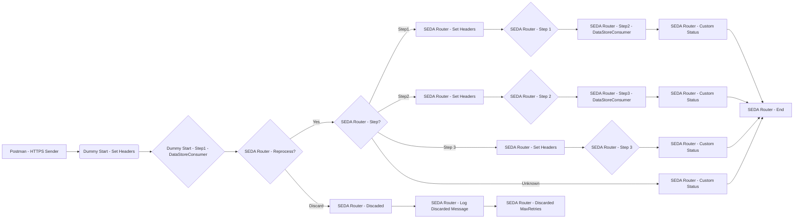

**iFlowId**: SEDA_Model_-_Single_DS_-_Restart_and_Discard_MMZ - **iFlowVersion**: 1.0.0

**Mermaid Diagram**

**Functional Summary**
- **Brief description of the iFlow**
  This iFlow demonstrates a SEDA (Staged Event-Driven Architecture) pattern for asynchronous message processing. It receives messages, persists them in a Data Store, and then processes them in stages (Step 1, Step 2, Step 3). It includes error handling, retry logic, and message discarding capabilities.

- **Involved systems with Adapters Type and Endpoint Type**
  - Postman - HTTPS (Sender)
  - DS - DataStoreConsumer (Sender)

- **Key steps**
  1. Receives a message via HTTPS from Postman.
  2. Stores the message in a Data Store (Step1).
  3. Retrieves the message from the Data Store.
  4. Routes the message to different processing steps (Step 1, Step 2, Step 3) based on the `Step` header.
  5. Each step enriches the message and stores it back in the Data Store.
  6. If the message fails to be processed after a certain number of retries, it is discarded.
  7. Logs exceptions asynchronously.

- **Message transformation**
  - The iFlow uses Enrichers to set headers and custom status messages at various stages.
  - Groovy scripts are used for logging discarded messages and exceptions.
  - The content of the message is wrapped in XML format.

- **Externalized parameters list and their descriptions**
  - `RoleName`: Role required to access the HTTPS endpoint.
  - `Maximum Retry Interval`: Maximum interval between retries for DataStoreConsumer.
  - `Exponential Backoff`: Flag to enable exponential backoff for DataStoreConsumer retries.
  - `Data Store Name`: Name of the Data Store used for message persistence.
  - `Poll Interval`: Interval for polling messages from the Data Store.
  - `Retry Interval`: Interval between retries for DataStoreConsumer.
  - `Lock Timeout`: Timeout for file lock in DataStoreConsumer.
  - `Retention Threshold 4 Alerting`: Retention threshold for alerting in DB storage.
  - `Expiration Period`: Expiration period for messages in DB storage.
  - `MaxRetries`: Maximum number of retries before discarding a message.

- **DataStore / JMS Dependency**
  Yes

- **Cloud Connector Dependency**
  Not Found

- **Common Scripts Dependency**
  - Groovy_Logging_Scripts

- **ProcessDirect ComponentType Dependency**
  Not Found