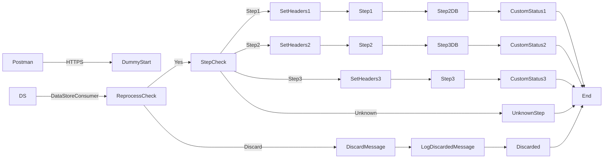

**iFlowId**: SEDA_Model_-_Single_DS_-_Restart_and_Discard_MMZ - **iFlowVersion**: 1.0.0

**Mermaid Diagram**

**Functional Summary**
-   **Brief description of the iFlow**
    This iFlow processes messages using a SEDA router pattern, persisting data in a Data Store. It handles message reprocessing based on the number of retries. Messages exceeding the maximum retry limit are discarded, with exception handling and logging capabilities.

-   **Involved systems with Adapters Type and Endpoint Type**
    -   Postman: HTTPS (Sender)
    -   DS: DataStoreConsumer (Sender)

-   **Key steps**
    1.  Receive message from HTTPS endpoint or DataStore.
    2.  Check if the message should be reprocessed based on retry count.
    3.  Route message to Step1, Step2 or Step3 based on the `Step` header value.
    4.  Each step stores the message in a Data Store.
    5.  If the message processing fails in a step, log the exception.
    6.  If the message exceeds the maximum retries, discard the message and log it.

-   **Message transformation**
    -   "Set Headers" components create or update headers such as `SAP_Sender`, `SAP_Receiver`, `SAP_MessageType`, and `Step` with constant values.
    -   "Custom Status" components add custom status messages to the `SAP_MessageProcessingLogCustomStatus` header using constant values or expressions.
    -   "Prepare Step" components enrich the message with constant content in base64 format

-   **Externalized parameters list and their descriptions**
    -   `Data Store Name`: Name of the Data Store used for persistence.
    -   `Maximum Retry Interval`: Maximum interval for retries.
    -   `Exponential Backoff`: Flag for exponential backoff.
    -   `Poll Interval`: Interval for polling Data Store.
    -   `Retry Interval`: Interval for retrying Data Store operations.
    -   `Lock Timeout`: Timeout for Data Store lock.
    -   `Retention Threshold 4 Alerting`: Retention threshold for alerting.
    -   `Expiration Period`: Expiration period for data in the Data Store.
    -   `RoleName`: Role name for HTTPS sender authentication.
    -   `MaxRetries`: Maximum number of retries before discarding the message.

-   **DataStore / JMS Dependency**
    Yes

-   **Cloud Connector Dependency**
    Not Found

-   **Common Scripts Dependency**
    -   Log_Discarded_Message.groovy (Groovy_Logging_Scripts)
    -   Log_Exception_Async.groovy (Groovy_Logging_Scripts)

-   **ProcessDirect ComponentType Dependency**
    Not Found