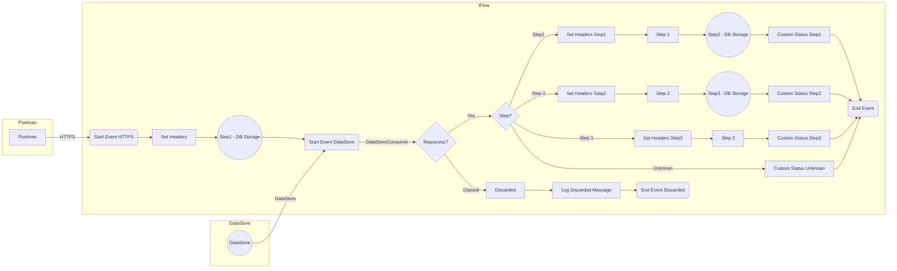

**iFlowId**: SEDA_Model_-_Single_DS_-_Restart_and_Discard_MMZ - **iFlowVersion**: 1.0.0

**Mermaid Diagram**

**Functional Summary**
- **Brief description of the iFlow**
This iFlow demonstrates a SEDA router pattern with a single DataStore consumer. It retrieves messages from a DataStore, processes them through a series of steps (Step 1, Step 2, Step 3), and includes error handling with exception logging. The iFlow also includes logic to discard messages after a certain number of retries. It can be triggered by an HTTPS call or by the DataStore Consumer.

- **Involved systems with Adapters Type and Endpoint Type**
    - Postman - HTTPS - EndpointSender
    - DS - DataStoreConsumer - EndpointSender

- **Key steps**
    1.  Receive message via HTTPS or DataStore Consumer.
    2.  Store the message in DataStore (Step1).
    3.  Retrieve message from DataStore and process Step 1.
    4.  Store the message in DataStore (Step2).
    5.  Retrieve message from DataStore and process Step 2.
    6.  Store the message in DataStore (Step3).
    7.  Retrieve message from DataStore and process Step 3.
    8.  Determine the next step based on the `Step` header.
    9.  If `MaxRetries` is reached, discard the message.
    10. Log exceptions in case of errors.

- **Message transformation**
    - Enrichers are used to set headers (e.g., `SAP_Sender`, `SAP_Receiver`, `SAP_MessageType`, `Step`) and custom status messages.
    - Groovy scripts are used for logging and potentially throwing exceptions.
    - The "Prepare Step" call activities add a header `Step` with the next step to be executed.

- **Externalized parameters list and their descriptions**
    - `RoleName`: Role required to access the HTTPS endpoint.
    - `Maximum Retry Interval`: Maximum interval for retrying DataStore operations.
    - `Exponential Backoff`: Flag to enable exponential backoff for DataStore retries.
    - `Data Store Name`: Name of the DataStore used for message persistence.
    - `Poll Interval`: Interval for polling the DataStore.
    - `Retry Interval`: Interval for retrying DataStore operations.
    - `Lock Timeout`: Timeout for file locking in the DataStore.
    - `Retention Threshold 4 Alerting`: Retention threshold for alerting in DB storage.
    - `Expiration Period`: Expiration period for messages in DB storage.
    - `MaxRetries`: Maximum number of retries before discarding a message.

- **DataStore / JMS Dependency**
Yes

- **Cloud Connector Dependency**
Not Found

- **Common Scripts Dependency**
    - Log_Discarded_Message.groovy - Groovy_Logging_Scripts
    - Log_Exception_Async.groovy - Groovy_Logging_Scripts

- **ProcessDirect ComponentType Dependency**
Not Found