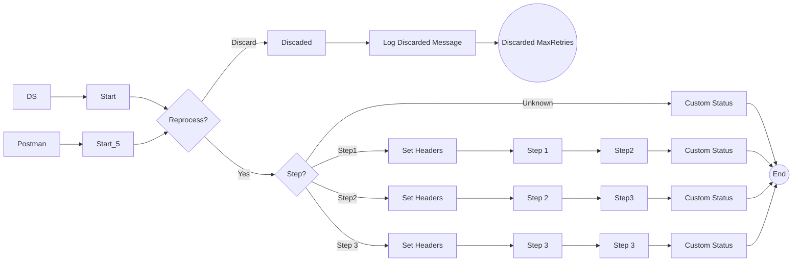

**iFlowId**: SEDA_Model_-_Single_DS_-_Restart_and_Discard_MMZ - **iFlowVersion**: 1.0.0

**Mermaid Diagram**

**Functional Summary**
- **Brief description of the iFlow**
This iFlow demonstrates a SEDA (Staged Event-Driven Architecture) model for processing messages retrieved from a Data Store. It includes steps for message processing, exception handling, and discarding messages that exceed the maximum retry attempts. The flow starts with a message from either an HTTPS endpoint or a Data Store, routes the message through several processing steps, and logs exceptions asynchronously.

- **Involved systems with Adapters Type and Endpoint Type**
    - Postman - HTTPS - Sender
    - DS - DataStoreConsumer - Sender

- **Key steps**
    1. Receive message from HTTPS endpoint or DataStore.
    2. Determine if the message needs to be reprocessed based on retry attempts.
    3. Route the message to Step 1, Step 2, or Step 3 based on the `Step` header.
    4. Each step (Step 1, Step 2, Step 3) enriches the message and calls a local integration process.
    5. If an exception occurs in any step, log the exception asynchronously.
    6. If the maximum retry attempts are exceeded, discard the message and log it.

- **Message transformation**
    - Set Headers: Sets headers like `SAP_Sender`, `SAP_Receiver`, `SAP_MessageType`, and `Step` at various stages.
    - Custom Status: Sets custom status messages in the message processing log.
    - Prepare Step X: Enricher to prepare the message for the next step.

- **Externalized parameters list and their descriptions**
    - RoleName: User role for HTTPS sender authentication.
    - Maximum Retry Interval: Maximum retry interval for DataStore consumer.
    - Exponential Backoff: Exponential backoff setting for DataStore consumer.
    - Data Store Name: Name of the Data Store.
    - Poll Interval: Poll interval for DataStore consumer.
    - Retry Interval: Retry interval for DataStore consumer.
    - Lock Timeout: Lock timeout for DataStore consumer.
    - Retention Threshold 4 Alerting: Retention threshold for alerting in DataStore.
    - Expiration Period: Expiration period for DataStore entries.
    - MaxRetries: Maximum number of retries before discarding a message.

- **DataStore / JMS Dependency**
Yes

- **Cloud Connector Dependency**
Not Found

- **Common Scripts Dependency**
    - Groovy_Logging_Scripts

- **ProcessDirect ComponentType Dependency**
Not Found