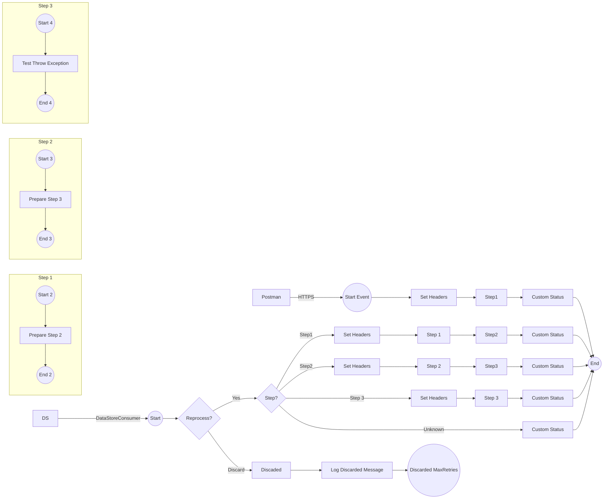

**iFlowId**: SEDA_Model_-_Single_DS_-_Restart_and_Discard_MMZ - **iFlowVersion**: 1.0.0

**Mermaid Diagram**

**Functional Summary**
- **Brief description of the iFlow**
This iFlow processes messages retrieved from a DataStore, routes them through a series of steps (Step 1, Step 2, Step 3), and handles exceptions that may occur during processing. It includes retry logic and discards messages that exceed the maximum retry attempts.

- **Involved systems with Adapters Type and Endpoint Type**
    - Postman - HTTPS - EndpointSender
    - DS - DataStoreConsumer - EndpointSender

- **Key steps**
    1.  Receive message via HTTPS from Postman or from DataStore.
    2.  Determine if the message should be reprocessed based on retry attempts.
    3.  Route the message to Step 1, Step 2, or Step 3 based on the `Step` header.
    4.  Execute the corresponding steps (Step 1, Step 2, Step 3) which involve preparing the step and potentially throwing an exception.
    5.  Store the message in the DataStore after each step.
    6.  If the message exceeds the maximum retry attempts, discard it.
    7.  Log exceptions that occur during the process.

- **Message transformation**
    - Enricher activities are used to set headers and custom status messages at various points in the iFlow.
    - Groovy scripts are used for logging and potentially throwing exceptions.
    - Prepare Step activities use Enrichers to set the Step header and wrap the message content.

- **Externalized parameters list and their descriptions**
    - `RoleName`: Role required to access the HTTPS endpoint.
    - `Maximum Retry Interval`: Maximum interval for retrying DataStore operations.
    - `Exponential Backoff`: Flag to enable exponential backoff for DataStore retries.
    - `Data Store Name`: Name of the DataStore used for message persistence.
    - `Poll Interval`: Interval for polling the DataStore.
    - `Retry Interval`: Interval for retrying DataStore operations.
    - `Lock Timeout`: Timeout for file locking in the DataStore.
    - `Retention Threshold 4 Alerting`: Threshold for alerting on data retention.
    - `Expiration Period`: Period after which data expires.
    - `MaxRetries`: Maximum number of retries before discarding a message.

- **DataStore / JMS Dependency**
Yes

- **Cloud Connector Dependency**
Not Found

- **Common Scripts Dependency**
    - Log_Discarded_Message.groovy - Groovy_Logging_Scripts
    - Log_Exception_Async.groovy - Groovy_Logging_Scripts

- **ProcessDirect ComponentType Dependency**
Not Found