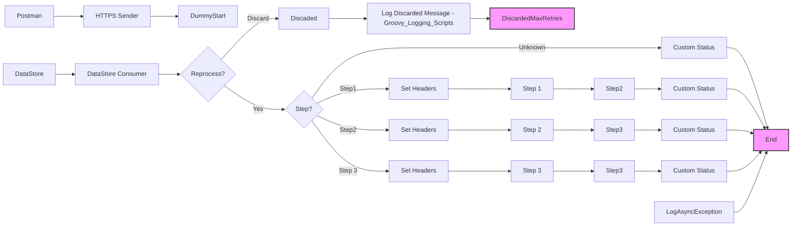

markdown
**iFlowId**: SEDA_Model_-_Single_DS_-_Restart_and_Discard_MMZ - **iFlowVersion**: 1.0.0

**Mermaid Diagram**
- **Visual representation of the flow**

**Functional Summary**
- **Brief description of the iFlow**
This iFlow processes messages retrieved from a Data Store, routes them based on the 'Step' header, and stores them back into the Data Store after each step. It includes error handling and a mechanism to discard messages that exceed a maximum retry count.

- **Involved systems with Adapters Type and Endpoint Type**
    - Postman - HTTPS - Sender
    - DS - DataStoreConsumer - Sender

- **Key steps**
 1. Receives a message either from HTTPS endpoint or DataStore.
 2. Checks if the message needs to be reprocessed based on retry count. If the retry count exceeds the maximum allowed, the message is discarded.
 3. Routes the message based on the 'Step' header to different processing steps (Step1, Step2, Step3).
 4. Each step stores the message in the Data Store.
 5. Sets custom status for message processing log after each step.
 6. Logs exceptions asynchronously.

- **Message transformation**
    - The iFlow uses Enrichers to set headers and custom status messages.
    - Prepare Step activities add headers to the message.

- **Externalized parameters list and their descriptions**
    - `{{RoleName}}`: User role for HTTPS sender authentication.
    - `{{Maximum Retry Interval}}`: Maximum retry interval for DataStore consumer.
    - `{{Exponential Backoff}}`: Exponential backoff setting for DataStore consumer.
    - `{{Data Store Name}}`: Name of the Data Store used for persistence.
    - `{{Poll Interval}}`: Poll interval for DataStore consumer.
    - `{{Retry Interval}}`: Retry interval for DataStore consumer.
    - `{{Lock Timeout}}`: Lock timeout for DataStore consumer.
    - `{{Retention Threshold 4 Alerting}}`: Retention threshold for alerting in DB storage.
    - `{{Expiration Period}}`: Expiration period for DB storage.
    - `{{MaxRetries}}`: Maximum number of retries before discarding a message.

- **DataStore / JMS Dependency**
Yes

- **Cloud Connector Dependency**
Not Found

- **Common Scripts Dependency**
    - Groovy_Logging_Scripts

- **ProcessDirect ComponentType Dependency**
Not Found