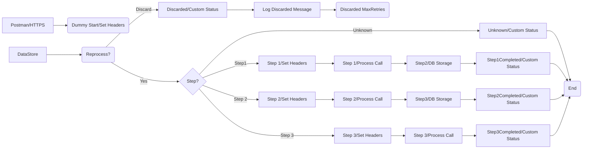

**iFlowId**: SEDA_Model_-_Single_DS_-_Restart_and_Discard_MMZ - **iFlowVersion**: 1.0.0

**Mermaid Diagram**

**Functional Summary**
- **Brief description of the iFlow**
  This iFlow demonstrates a SEDA (Staged Event-Driven Architecture) model for processing messages retrieved from a Data Store. It includes steps for processing the message, handling exceptions, and discarding messages that exceed the maximum retry attempts. The flow also includes custom status updates for monitoring purposes.

- **Involved systems with Adapters Type and Endpoint Type**
    - Postman: HTTPS (Sender)
    - DS: DataStoreConsumer (Sender) - JDBC

- **Key steps**
    1.  Receive message from HTTPS endpoint or DataStore.
    2.  Determine if the message should be reprocessed based on retry attempts.
    3.  Route the message to different processing steps (Step 1, Step 2, Step 3) based on the `Step` header.
    4.  Store the message in the Data Store after each step.
    5.  Update custom status logs for each step.
    6.  If the message exceeds the maximum retry attempts, discard it and log the event.
    7.  Log any exceptions that occur during processing.

- **Message transformation**
    - Enricher components are used to set headers and custom status messages.
    - Groovy scripts are used for logging discarded messages and exceptions.
    - Content modifiers are used to prepare messages for subsequent steps.

- **Externalized parameters list and their descriptions**
    - `RoleName`: Role required to access the HTTPS endpoint.
    - `Maximum Retry Interval`: Maximum retry interval for DataStore consumer.
    - `Exponential Backoff`: Flag to enable exponential backoff for DataStore consumer retries.
    - `Data Store Name`: Name of the Data Store used for message persistence.
    - `Poll Interval`: Interval for polling the Data Store.
    - `Retry Interval`: Interval for retrying DataStore operations.
    - `Lock Timeout`: Timeout for file lock in DataStore consumer.
    - `Retention Threshold 4 Alerting`: Retention threshold for alerting in DB storage.
    - `Expiration Period`: Expiration period for messages in DB storage.
    - `MaxRetries`: Maximum number of retries before discarding a message.

- **DataStore / JMS Dependency**
    Yes

- **Cloud Connector Dependency**
    Not Found

- **Common Scripts Dependency**
    - Log_Discarded_Message.groovy (scriptBundleId: Groovy_Logging_Scripts)
    - Log_Exception_Async.groovy (scriptBundleId: Groovy_Logging_Scripts)

- **ProcessDirect ComponentType Dependency**
    Not Found