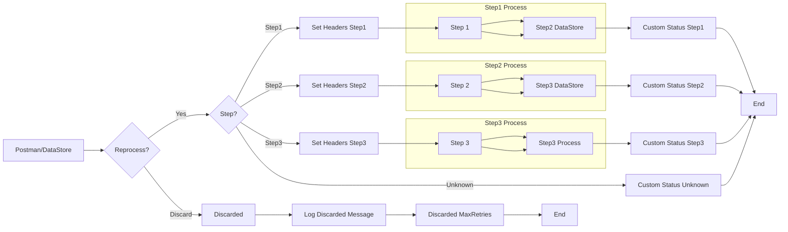

**iFlowId**: SEDA_Model_-_Single_DS_-_Restart_and_Discard_MMZ - **iFlowVersion**: 1.0.0

**Mermaid Diagram**

**Functional Summary**
- **Brief description of the iFlow**
This iFlow demonstrates a SEDA (Staged Event-Driven Architecture) model for asynchronous message processing using a Data Store. It includes steps for processing messages, handling exceptions, and discarding messages that exceed the maximum retry attempts. The flow starts with a message received via HTTPS or from a Data Store, routes the message through several processing steps, and logs exceptions. Messages can be discarded if processing fails after a certain number of retries.

- **Involved systems with Adapters Type and Endpoint Type**
    - Postman: HTTPS (Sender)
    - DS: DataStoreConsumer (Sender)

- **Key steps**
    1. Receive message via HTTPS or DataStore.
    2. Determine if message should be reprocessed. If not, discard the message.
    3. Route the message based on the 'Step' header to Step1, Step2, or Step3.
    4. Each step (Step1, Step2, Step3) prepares the message and calls a local integration process.
    5. Store the message in the Data Store after each step.
    6. Log exceptions during processing.
    7. Set custom status for each step.
    8. Discard messages exceeding maximum retries.

- **Message transformation**
    - Set Headers: Enricher components are used to set headers like SAP_Sender, SAP_Receiver, SAP_MessageType, and Step.
    - Custom Status: Enricher components are used to set custom status messages for logging.
    - Prepare Step X: Enricher components are used to prepare the message for each step.

- **Externalized parameters list and their descriptions**
    - RoleName: Role required to access the HTTPS endpoint.
    - Maximum Retry Interval: Maximum interval between retries for DataStore consumer.
    - Exponential Backoff: Flag to enable exponential backoff for DataStore consumer retries.
    - Data Store Name: Name of the Data Store used for persistence.
    - Poll Interval: Interval for polling the Data Store.
    - Retry Interval: Interval between retries for DataStore consumer.
    - Lock Timeout: Timeout for file lock in DataStore consumer.
    - Retention Threshold 4 Alerting: Retention threshold for alerting in DataStore.
    - Expiration Period: Expiration period for data in DataStore.
    - MaxRetries: Maximum number of retries before discarding a message.

- **DataStore / JMS Dependency**
Yes

- **Cloud Connector Dependency**
Not Found

- **Common Scripts Dependency**
List of scripts: Log_Discarded_Message.groovy, Log_Exception_Async.groovy, script1.groovy

- **ProcessDirect ComponentType Dependency**
Not Found