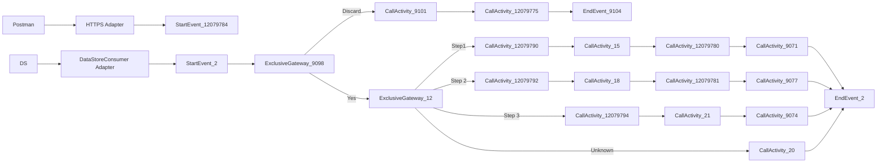

markdown
**iFlowId**: SEDA_Model_-_Single_DS_-_Restart_and_Discard_MMZ - **iFlowVersion**: 1.0.0

**Mermaid Diagram**

**Functional Summary**
- **Brief description of the iFlow**
This iFlow processes messages retrieved from a Data Store, routes them based on the 'Step' header, performs specific actions in each step (Step 1, Step 2, Step 3), and handles exceptions. It includes retry logic and discards messages exceeding the maximum retry attempts. It also allows triggering exceptions for testing purposes.

- **Involved systems with Adapters Type and Endpoint Type**
    - Postman - HTTPS - EndpointSender
    - DS - DataStoreConsumer - EndpointSender

- **Key steps**
 1. Receives message from HTTPS endpoint or DataStore.
 2. Checks if the message needs to be reprocessed based on retry attempts. If the maximum retries are exceeded, the message is discarded.
 3. Routes the message based on the `Step` header value (Step1, Step2, Step3, or Unknown).
 4. Each step (Step 1, Step 2, Step 3) calls a local integration process to perform specific actions.
 5. Each step stores the message in the Data Store.
 6. Sets custom status messages for logging purposes.
 7. Logs exceptions asynchronously.
 8. Ends the iFlow.

- **Message transformation**
    - Set Headers: Enricher to set headers like SAP_Sender, SAP_Receiver, SAP_MessageType, and Step.
    - Custom Status: Enricher to set SAP_MessageProcessingLogCustomStatus based on expressions.
    - Prepare Step X: Enricher to prepare the message for each step.

- **Externalized parameters list and their descriptions**
    - RoleName: User role for HTTPS sender authentication.
    - Maximum Retry Interval: Maximum retry interval for DataStore consumer.
    - Exponential Backoff: Flag to enable exponential backoff for DataStore consumer.
    - Data Store Name: Name of the Data Store.
    - Poll Interval: Poll interval for DataStore consumer.
    - Retry Interval: Retry interval for DataStore consumer.
    - Lock Timeout: Lock timeout for DataStore consumer.
    - Retention Threshold 4 Alerting: Retention threshold for alerting in DB storage.
    - Expiration Period: Expiration period for DB storage.
    - MaxRetries: Maximum number of retries before discarding the message.

- **DataStore / JMS Dependency**
Yes

- **Cloud Connector Dependency**
Not Found

- **Common Scripts Dependency**
    - Groovy_Logging_Scripts

- **ProcessDirect ComponentType Dependency**
Not Found