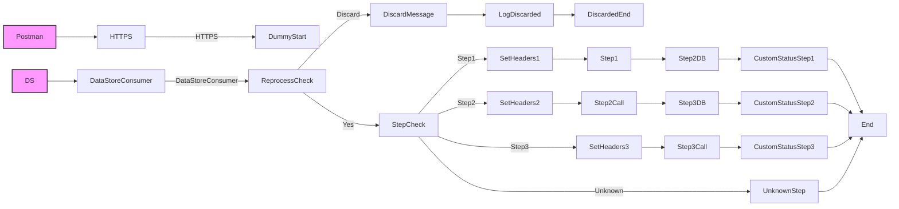

**iFlowId**: SEDA_Model_-_Single_DS_-_Restart_and_Discard_MMZ - **iFlowVersion**: 1.0.0

**Mermaid Diagram**

**Functional Summary**
-   **Brief description of the iFlow**
    This iFlow processes messages retrieved from a DataStore, routes them based on the "Step" header, performs specific actions at each step (simulated by calling local integration processes), and handles exceptions by logging them. It also includes logic to discard messages that exceed a maximum retry count.
-   **Involved systems with Adapters Type and Endpoint Type**
    -   Postman - HTTPS - Sender
    -   DS - DataStoreConsumer - Sender
-   **Key steps**
    1.  Receive message from HTTPS endpoint (Postman) and set initial headers. Alternatively, receive message from DataStore.
    2.  Check if the message has exceeded the maximum retry count. If so, discard the message.
    3.  Route the message to different "Step" processes based on the value of the "Step" header.
    4.  Each "Step" process (Step 1, Step 2, Step 3) prepares the message and simulates processing by creating message logs. They also have their own exception subprocesses.
    5.  Store intermediate step messages in a datastore
    6.  Update message processing log with custom statuses throughout the flow.
-   **Message transformation**
    -   The iFlow uses Enrichers to set headers (e.g., SAP_Sender, SAP_Receiver, SAP_MessageType, Step) with constant values.
    -   Custom Status elements add a SAP_MessageProcessingLogCustomStatus.
    -   Wrap content elements are used to prepare the step messages.
    -   Groovy scripts used to log discarded messages and exceptions
-   **Externalized parameters list and their descriptions**
    -   `RoleName`: Role name for HTTPS sender authorization.
    -   `Maximum Retry Interval`: Max retry interval for DataStore consumer.
    -   `Exponential Backoff`: Flag to enable exponential backoff for DataStore consumer retries.
    -   `Data Store Name`: Name of the DataStore used for message persistence.
    -   `Poll Interval`: Polling interval for the DataStore consumer.
    -   `Retry Interval`: Retry interval for the DataStore consumer.
    -   `Lock Timeout`: Lock timeout for the DataStore consumer.
    -   `Retention Threshold 4 Alerting`: Retention threshold for DataStore alerting.
    -   `Expiration Period`: Expiration period for DataStore entries.
    -   `MaxRetries`: Maximum retries before discarding the message.
-   **DataStore / JMS Dependency**
    Yes
-   **Cloud Connector Dependency**
    Not Found
-   **Common Scripts Dependency**
    -   Log_Discarded_Message.groovy - Groovy_Logging_Scripts
    -   Log_Exception_Async.groovy - Groovy_Logging_Scripts
-   **ProcessDirect ComponentType Dependency**
    Not Found