**iFlowId**: SEDA_Model_-_Single_DS_-_Restart_and_Discard_MMZ - **iFlowVersion**: 1.0.0

**Mermaid Diagram**

```mermaid
graph LR
    Postman --> HTTPS[Start5]
    DS --> DataStoreConsumer[Start]
    HTTPS -- HTTPS --> SetHeaders0
    DataStoreConsumer -- DataStore --> Reprocess
    Reprocess -- Yes --> Step?
    Reprocess -- Discard --> Discaded
    Step? -- Step1 --> SetHeaders1
    Step? -- Step2 --> SetHeaders2
    Step? -- Step3 --> SetHeaders3
    Step? -- Unknown --> CustomStatusUnknown
    SetHeaders1 --> Step1
    SetHeaders2 --> Step2
    SetHeaders3 --> Step3
    Step1 --> DataStore1[(Data Store Name)]
    Step2 --> DataStore2[(Data Store Name)]
    Step3 --> DataStore3[(Data Store Name)]
    DataStore1 --> CustomStatus1
    DataStore2 --> CustomStatus2
    DataStore3 --> CustomStatus3
    CustomStatus1 --> End
    CustomStatus2 --> End
    CustomStatus3 --> End
    CustomStatusUnknown --> End
    Discaded --> CustomStatusDiscarded
    CustomStatusDiscarded --> LogDiscardedMessage
    LogDiscardedMessage --> DiscardedMaxRetries
    DiscardedMaxRetries --> End
    DataStore1 --> CustomStatus1
    DataStore2 --> CustomStatus2
    DataStore3 --> CustomStatus3
    subgraph Step1Process
    Step1 --> PrepareStep2
    PrepareStep2 --> EndStep1
    end
    subgraph Step2Process
    Step2 --> PrepareStep3
    PrepareStep3 --> EndStep2
    end
    subgraph Step3Process
    Step3 --> TestThrowException
    TestThrowException --> EndStep3
    end
    
    
    
    
    
    
    
    
    
    
    
    
    
    
    
    
    
    
    
    
    
    
    
    
    
    
    
    
    
    
    
    
    
    
    
    
    
    
    
    
    
    
    
    
    
    
    
    
    
    
    
    
    
    
    
    
    
    
    
    
    
    
    
    
    
    
    
    
    
    
    
    
    
    
    
    
    
    
    
    
    
    
    
    
    
    
    
    
    
    
    
    
    
    
    
    
    
    
    
    
    
    
    
    
    
    
    
    
    
    
    
    
    
    
    
    
    
    
    
    
    
    
    
    
    
    
    
    
    
    
    
    
    
    
    
    
    
    
    
    
    
    
    
    
    
    
    
    
    
    
    
    
    
    
    
    
    
    
    
    
    
    
    
    
    
    
    
    
    
    
    
    
    
    
    
    
    
    
    
    
    
    
    
    
    
    
    
    
    
    
    
    
    
    
    
    
    
    
    
    
    
    
    
    
    
    
    
    
    
    
    
    
    
    
    
    
    
    
    
    
    
    
    
    
    
    
    
    
    
    
    
    
    
    
    
    
    
    
    
    
    
    
    
    
    
    
    
    
    
    
    
    
    
    
    
    
    
    
    
    
    
    
    
    
    
    
    
    
    
    
    
    
    
    
    
    
    
    
    
    
    
    
    
    
    
    
    
    
    
    
    
    
    
    
    
    
    
    
    
    
    
    
    
    
    
    
    
    
    
    
    
    
    
    
    
    
    
    
    
    
    
    
    
    
    
    
    
    
    
    
    
    
    
    
    
    
    
    
    
    
    
    
    
    
    
    
    
    
    
    
    
    
    
    
    
    
    
    
    
    
    
    
    
    
    
    
    
    
    
    
    
    
    
    
    
    
    
    
    
    
    
    
    
    
    
    
    
    
    
    
    
    
    
    
    
    
    
    
    
    
    
    
    
    
    
    
    
    
    
    
    
    
    
    
    
    
    
    
    
    
    
    
    
    
    
    
    
    
    
    
    
    
    
    
    
    
    
    
    
    
    
    
    
    
    
    
    
    
    
    
    
    
    
    
    
    
    
    
    
    
    
    
    
    
    
    
    
    
    
    
    
    
    
    
    
    
    
    
    
    
    
    
    
    
    
    
    
    
    
    
    
    
    
    
    
    
    
    
    
    
    
    
    
    
    
    
    
    
    
    
    
    
    
    
    
    
    
    
    
    
    
    
    
    
    
    
    
    
    
    
    
    
    
    
    
    
    
    
    
    
    
    
    
    
    
    
    
    
    
    
    
    
    
    
    
    
    
    
    
    
    
    
    
    
    
    
    
    
    
    
    
    
    
    
    
    
    
    
    
    
    
    
    
    
    
    
    
    
    
    
    
    
    
    
    
    
    
    
    
    
    
    
    
    
    
    
    
    
    
    
    
    
    
    
    
    
    
    
    
    
    
    
    
    
    
    
    
    
    
    
    
    
    
    
    
    
    
    
    
    
    
    
    
    
    
    
    
    
    
    
    
    
    
    
    
    
    
    
    
    
    
    
    
    
    
    
    
    
    
    
    
    
    
    
    
    
    
    
    
    
    
    
    
    
    
    
    
    
    
    
    
    
    
    
    
    
    
    
    
    
    
    
    
    
    
    
    
    
    
    
    
    
    
    
    
    
    
    
    
    
    
    
    
    
    
    
    
    
    
    
    
    
    
    
    
    
    
    
    
    
    
    
    
    
    
    
    
    
    
    
    
    
    
    
    
    
    
    
    
    
    
    
    
    
    
    
    
    
    
    
    
    
    
    
    
    
    
    
    
    
    
    
    
    
    
    
    
    
    
    
    
    
    
    
    
    
    
    
    
    
    
    
    
    
    
    
    
    
    
    
    
    
    
    
    
    
    
    
    
    
    
    
    
    
    
    
    
    
    
    
    
    
    
    
    
    
    
    
    
    
    
    
    
    
    
    
    
    
    
    
    
    
    
    
    
    
    
    
    
    
    
    
    
    
    
    
    
    
    
    
    
    
    
    
    
    
    
    
    
    
    
    
    
    
    
    
    
    
    
    
    
    
    
    
    
    
    
    
    
    
    
    
    
    
    
    
    
    
    
    
    
    
    
    
    
    
    
    
    
    
    
    
    
    
    
    
    
    
    
    
    
    
    
    
    
    
    
    
    
    
    
    
    
    
    
    
    
    
    
    
    
    
    
    
    
    
    
    
    
    
    
    
    
    
    
    
    
    
    
    
    
    
    
    
    
    
    
    
    
    
    
    
    
    
    
    
    
    
    
    
    
    
    
    
    
    
    
    
    
    
    
    
    
    
    
    
    
    
    
    
    
    
    
    
    
    
    
    
    
    
    
    
    
    
    
    
    
    
    
    
    
    
    
    
```

**Functional Summary**
-   **Brief description of the iFlow**
    This iFlow demonstrates a SEDA router pattern with a single DataStore, restart, and discard mechanism. It receives messages either from an HTTPS endpoint or a DataStore, processes them through a series of steps, and either completes successfully, discards the message after maximum retries, or logs exceptions asynchronously.

-   **Involved systems with Adapters Type and Endpoint Type**
    -   Postman - HTTPS - EndpointSender
    -   DS - DataStoreConsumer - EndpointSender

-   **Key steps**
    1.  Receive message from HTTPS endpoint or DataStore.
    2.  Determine if the message should be reprocessed based on retry count. If the retry count exceeds the maximum, discard the message.
    3.  Route the message to different steps (Step 1, Step 2, Step 3) based on the `Step` header.
    4.  Each step prepares the message, calls a sub-process, and updates the message processing log.
    5.  Store the message in DataStore after Step1, Step2 and Step3.
    6.  Log any exceptions that occur during the process asynchronously.

-   **Message transformation**
    -   Set Headers: Used to set headers like `SAP_Sender`, `SAP_Receiver`, `SAP_MessageType`, and `Step`.
    -   Custom Status: Used to set the `SAP_MessageProcessingLogCustomStatus` based on the current step and message type.
    -   Prepare Step: Enricher to prepare the message for the next step.

-   **Externalized parameters list and their descriptions**
    -   `RoleName`: User role for HTTPS sender authentication.
    -   `Maximum Retry Interval`: Maximum retry interval for DataStore consumer.
    -   `Exponential Backoff`: Exponential backoff setting for DataStore consumer.
    -   `Data Store Name`: Name of the DataStore used for message persistence.
    -   `Poll Interval`: Poll interval for DataStore consumer.
    -   `Retry Interval`: Retry interval for DataStore consumer.
    -   `Lock Timeout`: Lock timeout for DataStore consumer.
    -   `Retention Threshold 4 Alerting`: Retention threshold for alerting in DataStore.
    -   `Expiration Period`: Expiration period for messages in DataStore.
    -   `MaxRetries`: Maximum number of retries before discarding the message.

-   **DataStore / JMS Dependency**
    Yes

-   **Cloud Connector Dependency**
    Not Found

-   **Common Scripts Dependency**
    -   Log_Discarded_Message.groovy - Groovy_Logging_Scripts
    -   Log_Exception_Async.groovy - Groovy_Logging_Scripts

-   **ProcessDirect ComponentType Dependency**
    Not Found