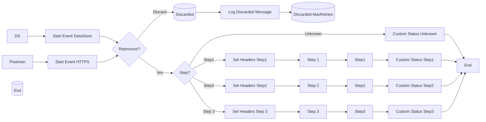

**iFlowId**: SEDA_Model_-_Single_DS_-_Restart_and_Discard_MMZ - **iFlowVersion**: 1.0.0

**Mermaid Diagram**

**Functional Summary**
- **Brief description of the iFlow**
This iFlow demonstrates a SEDA (Staged Event-Driven Architecture) model for processing messages asynchronously using a Data Store. It includes steps for message processing, exception handling, and discarding messages after a certain number of retries. The flow starts with a message received via HTTPS or DataStore, processes it through multiple steps, and stores the message in a Data Store at each step. It also includes logic to handle exceptions and discard messages that exceed the maximum retry limit.

- **Involved systems with Adapters Type and Endpoint Type**
    - Postman - HTTPS - EndpointSender
    - DS - DataStoreConsumer - EndpointSender

- **Key steps**
    1. Receive message via HTTPS or DataStore.
    2. Determine if the message should be reprocessed or discarded based on the retry count.
    3. Process the message through Step 1, Step 2, and Step 3.
    4. Store the message in the Data Store at each step.
    5. Handle exceptions in each step and log them.
    6. Discard messages that exceed the maximum retry limit.

- **Message transformation**
    - Enricher activities are used to set headers and custom statuses at various points in the flow.
    - Groovy scripts are used for logging and potentially throwing exceptions.
    - Content modifiers are used to prepare the message for each step.

- **Externalized parameters list and their descriptions**
    - RoleName: Role required to access the HTTPS endpoint.
    - Maximum Retry Interval: Maximum interval between retries for DataStoreConsumer.
    - Exponential Backoff: Flag to enable exponential backoff for DataStoreConsumer retries.
    - Data Store Name: Name of the Data Store used for message persistence.
    - Poll Interval: Interval for polling the Data Store.
    - Retry Interval: Interval between retries for DataStoreConsumer.
    - Lock Timeout: Timeout for file lock in DataStoreConsumer.
    - Retention Threshold 4 Alerting: Threshold for alerting on message retention.
    - Expiration Period: Period after which messages expire in the Data Store.
    - MaxRetries: Maximum number of retries before discarding a message.

- **DataStore / JMS Dependency**
Yes

- **Cloud Connector Dependency**
Not Found

- **Common Scripts Dependency**
    - Log_Discarded_Message.groovy - Groovy_Logging_Scripts
    - Log_Exception_Async.groovy - Groovy_Logging_Scripts

- **ProcessDirect ComponentType Dependency**
Not Found