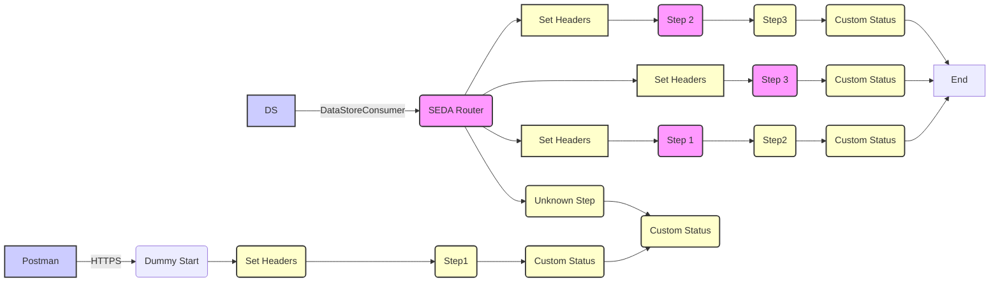

**iFlowId**: SEDA_Model_-_Single_DS_-_Restart_and_Discard_MMZ - **iFlowVersion**: 1.0.1

**Mermaid Diagram**

**BPMN Diagram**

**Functional Summary**
-   **Brief description of the iFlow**
    This iFlow demonstrates a SEDA (Staged Event-Driven Architecture) model with a single Data Store, including restart and discard mechanisms. It receives messages via HTTPS or DataStore, processes them through a series of steps, stores the data in a datastore with retries and discard, and logs exceptions asynchronously.

-   **Involved systems with Adapters Type and Endpoint Type**
    -   Postman - HTTPS (Sender)
    -   DS - DataStoreConsumer (Sender)

-   **Key steps**
    1.  Receive message via HTTPS or DataStore Consumer.
    2.  Check if the message should be reprocessed.
    3.  Route the message based on the `Step` header to `Step1`, `Step2`, or `Step3` for processing. If the step is unknown send to "UnknownStep".
    4.  Each step prepares data and logs completion status.
    5.  If `SAP_DataStoreRetries` is over `MaxRetries` then the message is discarted.
    6.  Store message details in the Data Store for `Step1`, `Step2` and `Step3`.
    7.  Log any exceptions that occur during processing.

-   **Message transformation**
    -   The iFlow enriches messages at several steps setting SAP headers.
    -   Prepare StepX prepare `Step` header setting value StepX
    -   Set Headers set SAP headers for Sender, Receiver, and MessageType.
    -   Custom Status call activity create SAP_MessageProcessingLogCustomStatus with message dependent values

-   **Externalized parameters list, configured values and their descriptions**
    -   `MaxRetries`: 3 - Maximum number of retries before discarding a message.
    -   `SEDA_MAIN_QUEUE`: SEDA_MODEL_MMZ - SEDA Main Queue Name.
    -   `Retention Threshold 4 Alerting`: 1 - Threshold for alerting on data retention.
    -   `Retry Interval`: 15 - Interval between retry attempts (in seconds).
    -   `Number of Concurrent Processes`: 1 - Number of concurrent processes.
    -   `Data Store Name`: SEDA_MODEL_MMZ - Name of the Data Store.
    -   `RoleName`: ESBMessaging.send - Role name for authorization.
    -   `Exponential Backoff`: 1 - Enable exponential backoff for retries.
    -   `Expiration Period`: 7 - Expiration period for stored data (in days).
    -   `Lock Timeout`: 10 - Timeout for locking data store entries.
    -   `Maximum Retry Interval`: 1440 - Maximum interval between retry attempts (in seconds).
    -   `Poll Interval`: 10 - Interval for polling the Data Store (in seconds).

-   **DataStore / JMS Dependency**
    Yes

-   **Cloud Connector Dependency**
    Not Found

-   **Common Scripts Dependency**
    -   `Log_Discarded_Message.groovy` - scriptBundleId: Groovy_Logging_Scripts
    -   `Log_Exception_Async.groovy` - scriptBundleId: Groovy_Logging_Scripts

-   **ProcessDirect ComponentType Dependency**
    Not Found