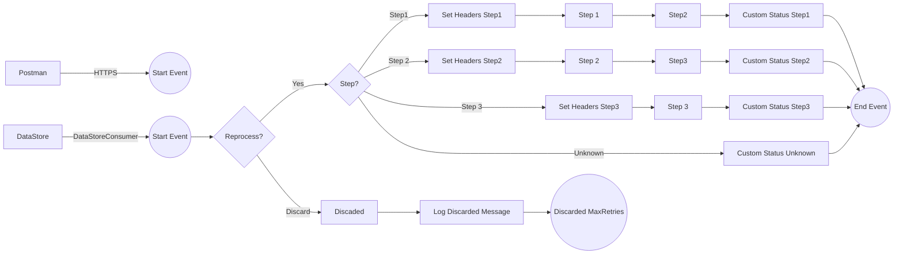

**iFlowId**: SEDA_Model_-_Single_DS_-_Restart_and_Discard_MMZ - **iFlowVersion**: 1.0.1

**Mermaid Diagram**

**BPMN Diagram**

**Functional Summary**
-   **Brief description of the iFlow**
    This iFlow demonstrates a SEDA (Staged Event-Driven Architecture) model with a single Data Store, handling message restart and discard based on retry counts. It involves receiving messages either from a DataStore or via HTTPS, processing them through several steps, storing data in a DataStore, and logging exceptions.

-   **Involved systems with Adapters Type and Endpoint Type**
    -   Postman - HTTPS - Sender
    -   DS - DataStoreConsumer - Sender

-   **Key steps**
    1.  Receive message from DataStore or HTTPS endpoint.
    2.  Determine retry attempts and continue to the next step or discard.
    3.  Process message through "Step 1," "Step 2," and "Step 3" local integration processes, storing message status and information in the DataStore at each step.
    4.  Set custom status messages to log processing status.
    5.  Log any exceptions that occur during processing.
    6.  Discard messages if maximum retries are exceeded, after logging.

-   **Message transformation**
    -   The iFlow uses Enrichers to set headers and custom status messages at various stages. Header values are primarily constants or expressions. The 'Step' header value determines the subsequent processing path.
    -   Prepare Step enrichers set headers to prepare a message for the next step (Step 1, Step 2, Step 3)

-   **Externalized parameters list, configured values and their descriptions**
    -   MaxRetries: 3 - Maximum number of retries before discarding a message.
    -   SEDA_MAIN_QUEUE: SEDA_MODEL_MMZ - Name of the SEDA queue.
    -   Retention Threshold 4 Alerting: 1 - Retention threshold for alerting.
    -   Retry Interval: 15 - Interval between retry attempts in minutes/seconds (unspecified).
    -   Number of Concurrent Processes: 1 - Number of concurrent processes allowed.
    -   Data Store Name: SEDA_MODEL_MMZ - Name of the DataStore used for persistence.
    -   RoleName: ESBMessaging.send - Role required to send messages.
    -   Exponential Backoff: 1 - Flag to enable exponential backoff for retries.
    -   Expiration Period: 7 - Message expiration period in days/hours (unspecified).
    -   Lock Timeout: 10 - Lock timeout value.
    -   Maximum Retry Interval: 1440 - Maximum retry interval in minutes/seconds (unspecified).
    -   Poll Interval: 10 - Polling interval for the DataStore Consumer.

-   **DataStore / JMS Dependency**
    Yes

-   **Cloud Connector Dependency**
    Not Found

-   **Common Scripts Dependency**
    -   Log_Discarded_Message.groovy - Groovy_Logging_Scripts
    -   Log_Exception_Async.groovy - Groovy_Logging_Scripts

-   **ProcessDirect ComponentType Dependency**
    Not Found