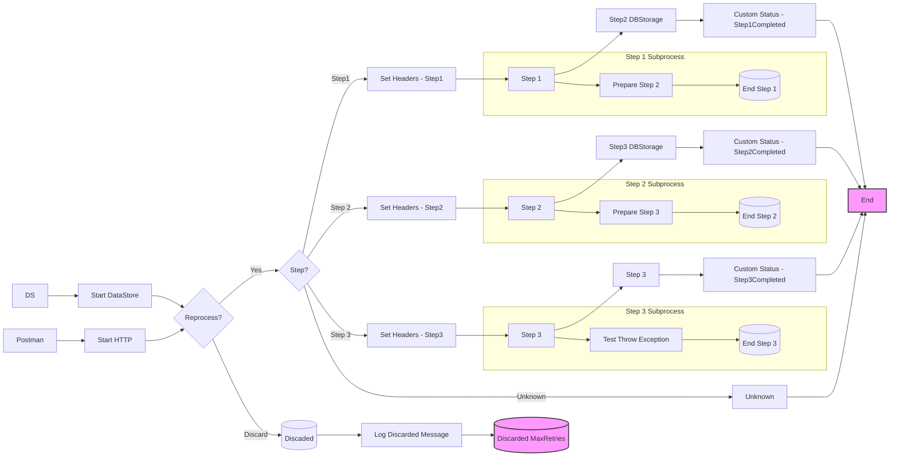

**iFlowId**: SEDA_Model_-_Single_DS_-_Restart_and_Discard_MMZ - **iFlowVersion**: 1.0.1

**Mermaid Diagram**

**Functional Summary**
- **Brief description of the iFlow**
The iFlow processes messages through a series of steps, storing message data in a DataStore for asynchronous processing. It includes retry logic and discards messages exceeding the maximum retry limit.

- **Involved systems with Adapters Type and Endpoint Type**
    - Postman (HTTPS, EndpointSender)
    - DS (DataStoreConsumer, EndpointSender)

- **Key steps**
 1. Receives a message via HTTPS or DataStore.
 2. Checks message processing retries, discards message if MaxRetries is reached.
 3. Routes message to different steps based on header 'Step' (Step1, Step2, Step3 or Unknown).
 4. Each Step process data (Step 1, Step 2, Step 3) and store the messages in DataStore to simulate asynchronous processing.
 5. Updates message processing log with custom statuses in each step.
 6. Logs exception asynchronously if errors occur in any of the steps.

- **Message transformation**
    - Setting Headers using Enrichers in Dummy Start, SEDA Router (multiple occurrences), Step 2 and Step 3 processes to define SAP_Sender, SAP_Receiver, SAP_MessageType and Step.
    - Custom Status using Enrichers in Dummy Start, SEDA Router (multiple occurrences), Step 2 and Step 3 processes to define SAP_MessageProcessingLogCustomStatus.
    - Groovy Scripts Log_Discarded_Message.groovy and Log_Exception_Async.groovy

- **Externalized parameters list, configured values and their descriptions**
    - MaxRetries: 3 - Maximum number of retries before discarding a message.
    - SEDA_MAIN_QUEUE: SEDA_MODEL_MMZ - JMS Queue Name. (Not used in the iFlow)
    - Retention Threshold 4 Alerting: 1 - Retention threshold for alerting (Not used in the iFlow).
    - Retry Interval: 15 - Interval between retries.
    - Number of Concurrent Processes: 1 - Number of concurrent processes (Not used in the iFlow).
    - Data Store Name: SEDA_MODEL_MMZ - Name of the DataStore.
    - RoleName: ESBMessaging.send - Role required for sending messages via HTTPS.
    - Exponential Backoff: 1 - Exponential backoff flag for retry (Not used in the iFlow).
    - Expiration Period: 7 - Expiration period for messages in DataStore.
    - Lock Timeout: 10 - Lock timeout for DataStore operations.
    - Maximum Retry Interval: 1440 - Maximum retry interval (Not used in the iFlow).
    - Poll Interval: 10 - Poll interval for DataStoreConsumer.

- **DataStore / JMS Dependency**
Yes

- **Cloud Connector Dependency**
Not Found

- **Common Scripts Dependency**
 - Groovy_Logging_Scripts : Log_Discarded_Message.groovy
 - Groovy_Logging_Scripts : Log_Exception_Async.groovy

- **ProcessDirect ComponentType Dependency**
Not Found