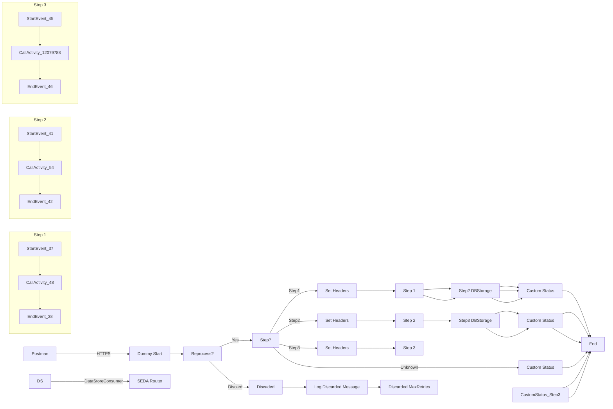

**iFlowId:** SEDA_Model_-_Single_DS_-_Restart_and_Discard_MMZ - **iFlowVersion:** 1.0.1

**Mermaid Diagram**

**BPMN Diagram**

**Functional Summary**
-   **Brief description of the iFlow:** This iFlow processes messages using a SEDA router, storing and retrieving data from a DataStore. It includes steps to handle exceptions, log messages, and discard messages exceeding the maximum retry attempts. It also has logic to route messages to different steps based on header values.

-   **Involved systems with Adapters Type and Endpoint Type:**
    -   Postman - HTTPS - Sender
    -   DS - DataStoreConsumer - Sender

-   **Key steps:**
    1.  Receive message from HTTPS or DataStore.
    2.  Determine if message needs to be reprocessed based on `SAP_DataStoreRetries` header.
    3.  Route messages to "Step1", "Step2", "Step3" processes based on the "Step" header value. If the header is not set, the iFlow defaults to "Unknown" step.
    4.  Within each step, processes prepare and execute specific logic, catching exceptions and logging them.
    5.  If message has been reprocessed more than "MaxRetries" the message gets discarded.

-   **Message transformation:**
    -   Set Headers Enrichers are used to set headers such as `SAP_Sender`, `SAP_Receiver`, `SAP_MessageType`, and `Step` before calling subsequent processes.
    -   Custom Status Enrichers are used to set the `SAP_MessageProcessingLogCustomStatus` header to provide custom status messages.

-   **Externalized parameters list, configured values and their descriptions:**
    -   MaxRetries: 3 - Maximum number of retries before discarding a message.
    -   SEDA_MAIN_QUEUE: SEDA_MODEL_MMZ - Name of the SEDA queue.
    -   Retention Threshold 4 Alerting: 1 - Retention threshold for alerting.
    -   Retry Interval: 15 - Interval between retry attempts in minutes.
    -   Number of Concurrent Processes: 1 - Number of concurrent processes.
    -   Data Store Name: SEDA_MODEL_MMZ - Name of the data store.
    -   RoleName: ESBMessaging.send - Role required to send messages.
    -   Exponential Backoff: 1 - Flag to enable exponential backoff.
    -   Expiration Period: 7 - Expiration period for messages in days.
    -   Lock Timeout: 10 - Timeout for file locking in seconds.
    -   Maximum Retry Interval: 1440 - Maximum retry interval in minutes.
    -   Poll Interval: 10 - Interval to poll DataStore.

-   **DataStore / JMS Dependency:** Yes

-   **Cloud Connector Dependency:** Not Found

-   **Common Scripts Dependency:**
    -   Groovy_Logging_Scripts - Log_Discarded_Message.groovy
    -   Groovy_Logging_Scripts - Log_Exception_Async.groovy

-   **ProcessDirect ComponentType Dependency:** Not Found