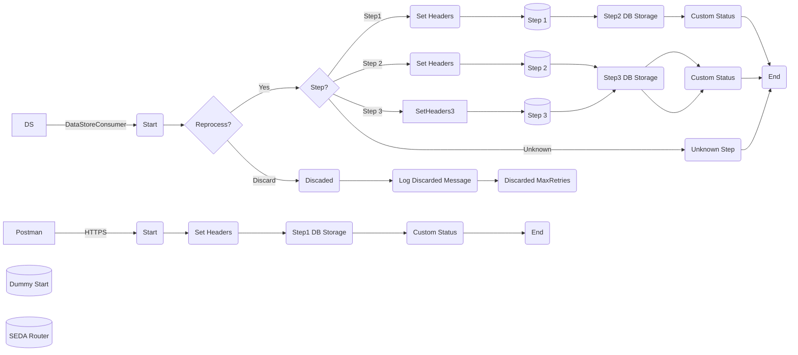

**iFlowId**: SEDA_Model_-_Single_DS_-_Restart_and_Discard_MMZ - **iFlowVersion**: 1.0.1

**Mermaid Diagram**

**BPMN Diagram**

**Functional Summary**
-   **Brief description of the iFlow**
    This iFlow processes messages using a SEDA (Staged Event-Driven Architecture) pattern. It retrieves messages from a Data Store or via HTTPS, processes them through a series of steps, and stores the results back in the Data Store. Messages exceeding retry limits are discarded, with exception logging.

-   **Involved systems with Adapters Type and Endpoint Type**
    -   Postman - HTTPS (Sender)
    -   DS - DataStoreConsumer (Sender) - JDBC

-   **Key steps**
    1.  Receives a message either via HTTPS or from the Data Store.
    2.  Determines whether to reprocess the message based on retry attempts.
    3.  Routes the message to different steps (Step1, Step2, Step3) based on the `Step` header value.
    4.  Each step prepares data, calls a sub-process for further processing and exception handling, and stores intermediate data in Data Store.
    5.  If maximum retries are reached, the message is discarded and logged.
    6.  Sets custom statuses in message processing logs to track progress.
    7.  Logs asynchronous exceptions via a dedicated subprocess.

-   **Message transformation**
    -   Enrichers are used to set headers like `SAP_Sender`, `SAP_Receiver`, `SAP_MessageType` and `Step`.
    -   Custom statuses are added to the message processing log using enrichers with expressions.
    -   Payload changes during sub-process calls.
    -   Step 2 and Step 1 use enrichers with wrapContent to add xml envelopes.

-   **Externalized parameters list, configured values and their descriptions**
    -   `MaxRetries`: 3 - Maximum number of retries before discarding a message.
    -   `SEDA_MAIN_QUEUE`: SEDA_MODEL_MMZ -  SEDA Main Queue Name.
    -   `Retention Threshold 4 Alerting`: 1 -  Retention Threshold for Alerting.
    -   `Retry Interval`: 15 - Interval between retries in seconds.
    -   `Number of Concurrent Processes`: 1 - Number of concurrent processes.
    -   `Data Store Name`: SEDA_MODEL_MMZ - Name of the Data Store.
    -   `RoleName`: ESBMessaging.send - Role name for HTTPS sender authentication.
    -   `Exponential Backoff`: 1 - Enable exponential backoff for retries.
    -   `Expiration Period`: 7 - Expiration period for data in Data Store (in days).
    -   `Lock Timeout`: 10 - Lock timeout for Data Store access.
    -   `Maximum Retry Interval`: 1440 - Maximum retry interval.
    -   `Poll Interval`: 10 - Poll interval for the Data Store consumer.

-   **DataStore / JMS Dependency**
    Yes

-   **Cloud Connector Dependency**
    Not Found

-   **Common Scripts Dependency**
    -   Log_Discarded_Message.groovy - Groovy_Logging_Scripts
    -   Log_Exception_Async.groovy - Groovy_Logging_Scripts

-   **ProcessDirect ComponentType Dependency**
    Not Found