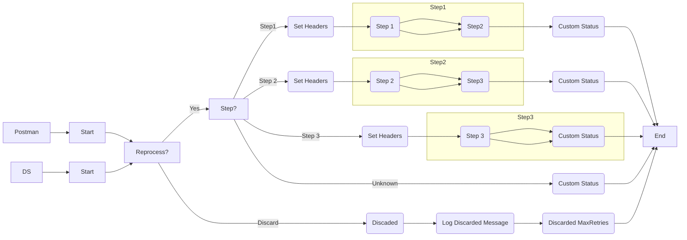

**iFlowId:** SEDA_Model_-_Single_DS_-_Restart_and_Discard_MMZ - **iFlowVersion:** 1.0.1

**Mermaid Diagram**

**BPMN Diagram**

**Functional Summary**
- **Brief description of the iFlow**
This iFlow demonstrates a SEDA (Staged Event-Driven Architecture) model with a single Data Store, including restart and discard mechanisms. It receives messages from either HTTPS or DataStore, processes them through several steps, and stores the data in a Data Store with retry logic and discard capabilities based on the number of retries. It includes error handling for exceptions during processing, logging, and setting custom statuses.

- **Involved systems with Adapters Type and Endpoint Type**
    - Postman - HTTPS - HTTPS
    - DS - DataStoreConsumer - JDBC

- **Key steps**
 1. Receive message from either HTTPS endpoint or DataStore.
 2. Based on the "Step" header, route the message to different processing steps (Step 1, Step 2, or Step 3).
 3.  Each step prepares some enrichment data for the following steps
 4. Store message payload in DataStore in steps 1,2,3, with encryption and expiration configurations
 5. If processing fails at any step, log the exception asynchronously.
 6. If the message processing retries exceed a defined limit, discard the message and log it.
 7. Set custom statuses at various stages to track the message's progress.

- **Message transformation**
The iFlow enriches message content through "Enricher" components, by setting headers to route to different steps

- **Externalized parameters list, configured values and their descriptions**
    - Data Store Name: SEDA_MODEL_MMZ - Name of the Data Store to store the message.
    - Expiration Period: 7 - Message Expiration period
    - Lock Timeout: 10 - Timeout in seconds when attempting to acquire a lock on the datastore.
    - MaxRetries: 3 - Maximum number of retries before discarding the message.
    - Maximum Retry Interval: 1440 - Maximum interval in minutes to retry datastore persistence.
    - Number of Concurrent Processes: 1 - Number of parallel process
    - Poll Interval: 10 - Poll interval in minutes to check if new messages arrived on DataStore
    - Retention Threshold 4 Alerting: 1 - Notifies when Retention Threshold reached.
    - Retry Interval: 15 - Interval in minutes to retry datastore persistence.
    - RoleName: ESBMessaging.send - Role required for sending messages to the iFlow.
    - SEDA_MAIN_QUEUE: SEDA_MODEL_MMZ - SEDA Main Queue Name
    - Exponential Backoff: 1 - If backoff enabled or not

- **DataStore / JMS Dependency**
Yes

- **Cloud Connector Dependency**
Not Found

- **Common Scripts Dependency**
    - Log_Discarded_Message.groovy - Groovy_Logging_Scripts
    - Log_Exception_Async.groovy - Groovy_Logging_Scripts

- **ProcessDirect ComponentType Dependency**
Not Found