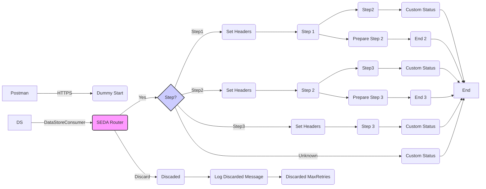
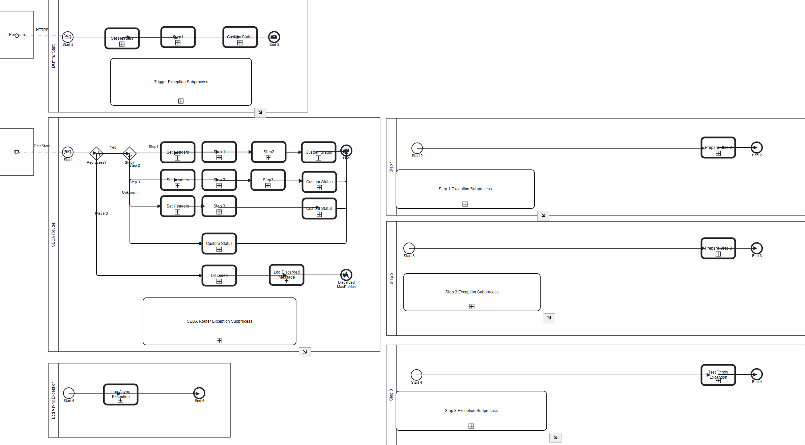

**iFlowId**: SEDA_Model_-_Single_DS_-_Restart_and_Discard_MMZ - **iFlowVersion**: 1.0.1

**Mermaid Diagram**

**BPMN Diagram**

**Functional Summary**
-   **Brief description of the iFlow**
    This iFlow demonstrates a SEDA (Staged Event-Driven Architecture) model with a single DataStore. It retrieves messages from a DataStore or via HTTPS, processes them in stages, and handles potential exceptions by logging them asynchronously. It also allows discarding messages after a certain number of retries.

-   **Involved systems with Adapters Type and Endpoint Type**
    -   Postman - HTTPS - Sender
    -   DS - DataStoreConsumer - Sender

-   **Key steps**
    1.  Receive message from DataStore or HTTPS endpoint.
    2.  Determine the next step based on the "Step" header, using an exclusive gateway.
    3.  Persist message to DataStore.
    4.  Call local integration processes for steps 1, 2 and 3.
    5.  In each step, set the “Step” header to the next step.
    6.  If there is any Exception in the process, it calls "Log Async Exception"
    7.  Discard message based on a defined MaxRetries.

-   **Message transformation**
    -   Content Enrichers are used to set headers such as `SAP_Sender`, `SAP_Receiver`, `SAP_MessageType`, and `Step`.
    -   Content Enrichers are used to set the `SAP_MessageProcessingLogCustomStatus` property.
    -   Wrap content within `<Envelope>` tags and encode `MessageB64`.

-   **Externalized parameters list, configured values and their descriptions**
    -   `MaxRetries`: 3 - Maximum number of retries before discarding the message.
    -   `SEDA_MAIN_QUEUE`: SEDA_MODEL_MMZ - Not Used
    -   `Retention Threshold 4 Alerting`: 1 - Threshold for alerting about message retention.
    -   `Retry Interval`: 15 - Interval (in seconds) between retry attempts for DataStore consumer.
    -   `Number of Concurrent Processes`: 1 - Not Used
    -   `Data Store Name`: SEDA_MODEL_MMZ - Name of the DataStore.
    -   `RoleName`: ESBMessaging.send - Role required to send messages via HTTPS.
    -   `Exponential Backoff`: 1 - Enable or Disable the Exponential Backoff for DataStore consumer.
    -   `Expiration Period`: 7 - Expiration period (in days) for messages stored in the DataStore.
    -   `Lock Timeout`: 10 - Lock timeout (in seconds) for DataStore consumer.
    -   `Maximum Retry Interval`: 1440 - Maximum retry interval (in seconds) for DataStore consumer.
    -   `Poll Interval`: 10 - Interval (in seconds) for polling messages from the DataStore.

-   **DataStore / JMS Dependency**
    Yes

-   **Cloud Connector Dependency**
    Not Found

-   **Common Scripts Dependency**
    -   Log_Discarded_Message.groovy - Groovy_Logging_Scripts
    -   Log_Exception_Async.groovy - Groovy_Logging_Scripts

-   **ProcessDirect ComponentType Dependency**
    Not Found