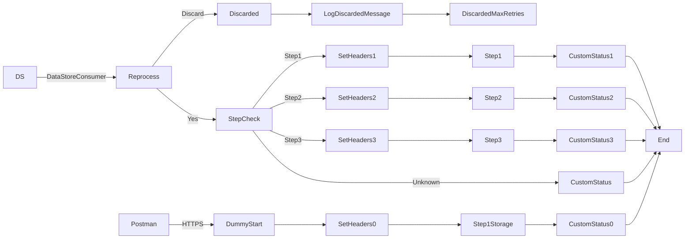

**iFlowId**: SEDA_Model_-_Single_DS_-_Restart_and_Discard_MMZ - **iFlowVersion**: 1.0.1

**Mermaid Diagram**

**BPMN Diagram**

**Functional Summary**
- **Brief description of the iFlow**
This iFlow demonstrates a SEDA (Staged Event-Driven Architecture) pattern with a single Data Store. It includes functionalities for restarting and discarding messages based on retry attempts. It receives messages either via HTTPS or from a DataStore, processes them in stages, and handles exceptions asynchronously.

- **Involved systems with Adapters Type and Endpoint Type**
    - Postman - HTTPS - Sender
    - DS - DataStoreConsumer - Sender

- **Key steps**
    1. Receive messages either via HTTPS endpoint or DataStore Consumer.
    2. Determine if the message should be reprocessed based on retry attempts. If the maximum number of retries is exceeded, the message is discarded.
    3. Route the message based on the `Step` header to different processing steps (Step1, Step2, Step3).
    4. Each step prepares the message for the next step, calls a sub-process and persist message information to the Data Store.
    5. Update the message processing log with a custom status after each step.
    6. If an exception occurs in any step, log the exception asynchronously.

- **Message transformation**
    - Enricher components are used to set headers such as `SAP_Sender`, `SAP_Receiver`, `SAP_MessageType`, and `Step`.
    - Custom status messages are created using expressions based on header values.
    - Message content is wrapped or modified in Enricher components to prepare for subsequent steps.

- **Externalized parameters list, configured values and their descriptions**
    - `MaxRetries`: 3 - Maximum number of retry attempts before discarding the message.
    - `SEDA_MAIN_QUEUE`: SEDA_MODEL_MMZ - The name of the SEDA queue.
    - `Retention Threshold 4 Alerting`: 1 - Retention threshold for alerting purposes.
    - `Retry Interval`: 15 - Interval between retry attempts in minutes.
    - `Number of Concurrent Processes`: 1 - Number of concurrent processes.
    - `Data Store Name`: SEDA_MODEL_MMZ - Name of the Data Store.
    - `RoleName`: ESBMessaging.send - Role name for authentication.
    - `Exponential Backoff`: 1 - Exponential backoff factor for retry intervals.
    - `Expiration Period`: 7 - Expiration period for messages in days.
    - `Lock Timeout`: 10 - Lock timeout for Data Store operations in minutes.
    - `Maximum Retry Interval`: 1440 - Maximum retry interval in minutes.
    - `Poll Interval`: 10 - Poll interval for the DataStore Consumer in minutes.

- **DataStore / JMS Dependency**
Yes

- **Cloud Connector Dependency**
Not Found

- **Common Scripts Dependency**
    - Log_Exception_Async.groovy - Groovy_Logging_Scripts
    - Log_Discarded_Message.groovy - Groovy_Logging_Scripts

- **ProcessDirect ComponentType Dependency**
Not Found