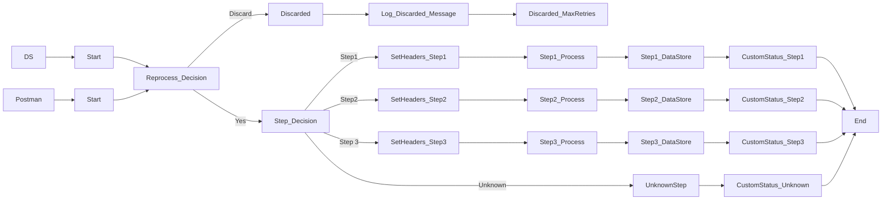

**iFlowId**: SEDA_Model_-_Single_DS_-_Restart_and_Discard_MMZ - **iFlowVersion**: 1.0.1

**Mermaid Diagram**

**BPMN Diagram**

**Functional Summary**
-   **Brief description of the iFlow**
    This iFlow demonstrates a SEDA (Staged Event-Driven Architecture) model using a single Data Store. It retrieves messages from a Data Store, processes them through a series of steps, and either stores the results back in the Data Store or discards the message based on the number of retries. It also includes exception handling and logging capabilities.

-   **Involved systems with Adapters Type and Endpoint Type**
    -   Postman (HTTPS, EndpointSender)
    -   DS (DataStoreConsumer, EndpointSender)

-   **Key steps**
    1.  Receive message via HTTPS or DataStore.
    2.  Determine if the message needs to be reprocessed or discarded based on the retry count.
    3.  Route the message to Step1, Step2 or Step3.
    4.  Persist information in DataStore for each step.
    5.  Log completion and exceptions during processing.
    6.  Discard Message if MaxRetries is reached.

-   **Message transformation**
    -   The iFlow uses Enrichers to set headers such as `SAP_Sender`, `SAP_Receiver`, and `SAP_MessageType`.
    -   Custom Status Enrichers add `SAP_MessageProcessingLogCustomStatus` at various stages.
    -   Groovy scripts, like `Log_Discarded_Message.groovy` and `Log_Exception_Async.groovy`, are used for logging.
    -   Step 2 and Step 1 enrichment activities prepare data for the other steps.

-   **Externalized parameters list, configured values and their descriptions**
    -   `MaxRetries`: 3 (Maximum number of retries before discarding a message.)
    -   `SEDA_MAIN_QUEUE`: SEDA_MODEL_MMZ (Name of the SEDA queue, not used directly in the flow but is present in the properties file)
    -   `Retention Threshold 4 Alerting`: 1 (Threshold for alerting based on retention, used in DB Storage.)
    -   `Retry Interval`: 15 (Interval between retries in seconds.)
    -   `Number of Concurrent Processes`: 1 (Number of concurrent processes to use, not used directly in the flow but is present in the properties file)
    -   `Data Store Name`: SEDA_MODEL_MMZ (Name of the Data Store.)
    -   `RoleName`: ESBMessaging.send (Role required for sending messages.)
    -   `Exponential Backoff`: 1 (Flag indicating whether to use exponential backoff.)
    -   `Expiration Period`: 7 (Expiration period for messages in days, used in DB Storage.)
    -   `Lock Timeout`: 10 (Timeout for locking resources, used by the DataStore adapter.)
    -   `Maximum Retry Interval`: 1440 (Maximum retry interval, used by the DataStore adapter.)
    -   `Poll Interval`: 10 (Poll interval for the Data Store Consumer adapter.)

-   **DataStore / JMS Dependency**
    Yes

-   **Cloud Connector Dependency**
    Not Found

-   **Common Scripts Dependency**
    -   Log_Discarded_Message.groovy (Groovy_Logging_Scripts)
    -   Log_Exception_Async.groovy (Groovy_Logging_Scripts)

-   **ProcessDirect ComponentType Dependency**
    Not Found