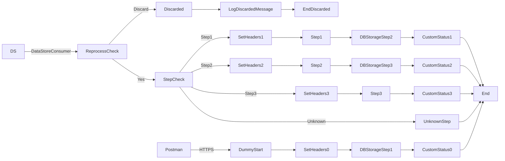

markdown
**iFlowId**: SEDA_Model_-_Single_DS_-_Restart_and_Discard_MMZ - **iFlowVersion**: 1.0.1

**Mermaid Diagram**

**Functional Summary**
- **Brief description of the iFlow**
This iFlow demonstrates a SEDA (Staged Event-Driven Architecture) model with a single DataStore, restart, and discard mechanism. It receives messages either from an HTTPS endpoint or a DataStore, processes them through several steps, and stores the messages in a DataStore. It includes retry logic and discards messages exceeding the maximum retry count.

- **Involved systems with Adapters Type and Endpoint Type**
    - Postman - HTTPS - Sender
    - DS - DataStoreConsumer - Sender

- **Key steps**
 1. Receive message from HTTPS or DataStore.
 2. Determine if the message needs to be reprocessed based on retry counts.
 3. If MaxRetries has been exceeded, discard the message.
 4. Based on the Step header value call Step 1, Step 2 or Step 3 processes.
 5. In each Step process prepare the following step with Prepare Step (X) and create/set header with "Step" and the next step.
 6. Each step process saves the data into the DataStore with Step(X) DBStorage.
 7. After completing each step, a custom status is created.
 8. If any exceptions occur during the steps, the "Log Async Exception" process is called and the exception is logged.

- **Message transformation**
    - Content enrichers are used to set message headers.
    - Groovy scripts are used for logging and potentially other custom logic (script1.groovy in Step3, Log_Discarded_Message.groovy, Log_Exception_Async.groovy).

- **Externalized parameters list, configured values and their descriptions**
    - MaxRetries: 3 - Maximum number of retries before discarding the message.
    - SEDA_MAIN_QUEUE: SEDA_MODEL_MMZ - JMS Queue Name. (Not Used, as the JMS is not configured, just configured as Required JMS in Transactional Handling)
    - Retention Threshold 4 Alerting: 1 - Retention threshold for alerting.
    - Retry Interval: 15 - Retry interval in minutes.
    - Number of Concurrent Processes: 1 - The number of concurrent processes allowed.
    - Data Store Name: SEDA_MODEL_MMZ - Name of the DataStore.
    - RoleName: ESBMessaging.send - Role required for sending messages.
    - Exponential Backoff: 1 - Flag to enable exponential backoff for retries.
    - Expiration Period: 7 - Expiration period for messages in days.
    - Lock Timeout: 10 - Lock timeout in seconds.
    - Maximum Retry Interval: 1440 - Maximum retry interval in minutes.
    - Poll Interval: 10 - Poll interval in minutes for DataStore Consumer

- **DataStore / JMS Dependency**
Yes

- **Cloud Connector Dependency**
Not Found

- **Common Scripts Dependency**
    - Log_Discarded_Message.groovy - Groovy_Logging_Scripts
    - Log_Exception_Async.groovy - Groovy_Logging_Scripts

- **ProcessDirect ComponentType Dependency**
Not Found