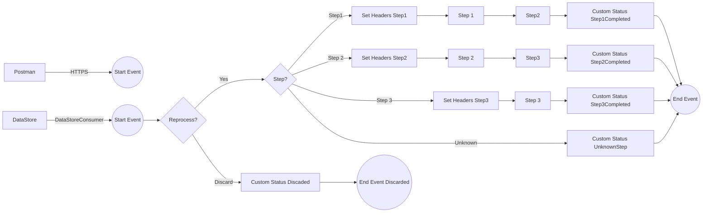

markdown
**iFlowId**: SEDA_Model_-_Single_DS_-_Restart_and_Discard_MMZ - **iFlowVersion**: 1.0.1

**Mermaid Diagram**

**BPMN Diagram**

**Functional Summary**
- **Brief description of the iFlow**
This iFlow processes messages through a series of steps (Step 1, Step 2, Step 3) and uses a Data Store for persistence and restart capabilities. It handles exceptions, logs errors, and discards messages exceeding the maximum retry limit. The iFlow is triggered either by an HTTPS call or by the Data Store Consumer.

- **Involved systems with Adapters Type and Endpoint Type**
    - Postman - HTTPS - Sender
    - DS - DataStoreConsumer - Sender

- **Key steps**
    1. Receive message from HTTPS endpoint or DataStore Consumer.
    2. Set initial headers and store the message in the DataStore.
    3. Route the message to subsequent steps (Step 1, Step 2, Step 3) based on the 'Step' header.
    4. Each step prepares the message, calls a sub-process and updates the message processing log.
    5. Store messages in the DataStore after each step
    6. Handle exceptions and log errors using a dedicated sub-process.
    7. Discard messages exceeding the 'MaxRetries' limit and log the discarded message.
    8. Complete message processing and set the final status.

- **Message transformation**
    - The iFlow uses Enrichers to set headers and custom status messages at various points.
    - Step 2 and Step 1 and Step 3 enricher use constant values to prepare sub process calls
    - Groovy scripts are used for exception logging and discarded message logging.

- **Externalized parameters list, configured values and their descriptions**
    - `MaxRetries`: 3 - Maximum number of retries before discarding a message.
    - `SEDA_MAIN_QUEUE`: SEDA_MODEL_MMZ - JMS Queue Name (not used)
    - `Retention Threshold 4 Alerting`: 1 - Retention threshold for alerting (days).
    - `Retry Interval`: 15 - Retry interval in minutes for DataStore consumption.
    - `Number of Concurrent Processes`: 1 - Number of concurrent processes (not used).
    - `Data Store Name`: SEDA_MODEL_MMZ - Name of the DataStore used for message persistence.
    - `RoleName`: ESBMessaging.send - Role required for sending messages via HTTPS.
    - `Exponential Backoff`: 1 - Enable exponential backoff for DataStore consumption retries.
    - `Expiration Period`: 7 - Expiration period in days for DataStore entries.
    - `Lock Timeout`: 10 - Lock timeout (unit unspecified) for DataStore consumption.
    - `Maximum Retry Interval`: 1440 - Maximum retry interval in minutes for DataStore consumption.
    - `Poll Interval`: 10 - Poll interval in seconds for DataStore consumption.

- **DataStore / JMS Dependency**
Yes

- **Cloud Connector Dependency**
Not Found

- **Common Scripts Dependency**
    - Log_Exception_Async.groovy - scriptBundleId: Groovy_Logging_Scripts
    - Log_Discarded_Message.groovy - scriptBundleId: Groovy_Logging_Scripts

- **ProcessDirect ComponentType Dependency**
Not Found