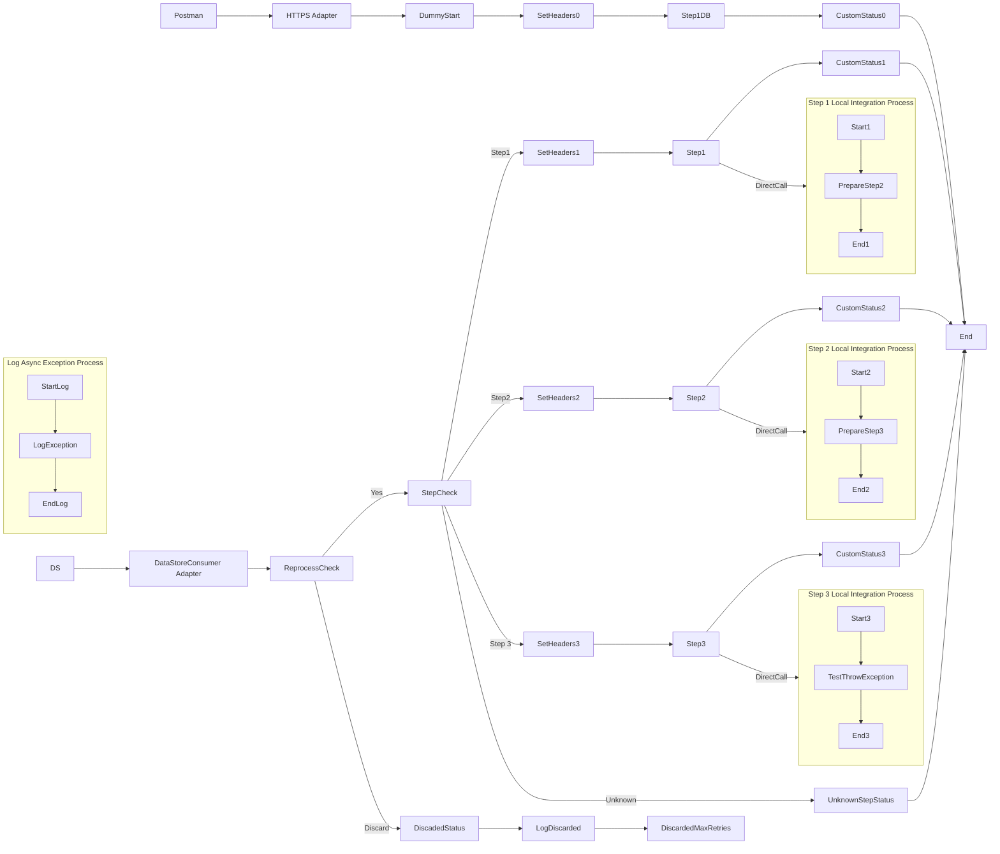

**iFlowId**: SEDA_Model_-_Single_DS_-_Restart_and_Discard_MMZ - **iFlowVersion**: 1.0.1

**Mermaid Diagram**

**BPMN Diagram**

**Functional Summary**
-   **Brief description of the iFlow**
    This iFlow demonstrates a SEDA (Staged Event-Driven Architecture) model, handling messages in stages, with restart and discard mechanisms. It receives messages either from a DataStore Consumer or via HTTPS, processes them through a series of steps, and stores data in a DataStore. It includes exception handling and logging.

-   **Involved systems with Adapters Type and Endpoint Type**
    -   Postman (HTTPS, EndpointSender)
    -   DS (DataStoreConsumer, EndpointSender)

-   **Key steps**
    1.  Receive message either via HTTPS or from the DataStore.
    2.  Determine message flow based on the `Step` header (Step1, Step2, Step3, or Unknown).
    3.  Based on the Step header, execute steps Step1, Step2 and Step3 which each sets a header value Step and calls a Local Integration Process. Those Integration Processes prepare a message, persist in DataStore, and sets the SAP_MessageProcessingLogCustomStatus
    4.  If `SAP_DataStoreRetries` exceeds `MaxRetries`, discard the message.

-   **Message transformation**
    -   Enricher components are used to set headers (e.g., `SAP_Sender`, `SAP_Receiver`, `SAP_MessageType`, `Step`).
    -   Enricher components are used to create custom status messages for logging.
    -   Groovy scripts are used for logging and potentially other message manipulations.

-   **Externalized parameters list, configured values and their descriptions**
    -   `MaxRetries`: 3 - Maximum number of retries before discarding the message.
    -   `SEDA_MAIN_QUEUE`: SEDA_MODEL_MMZ - JMS Queue Name.
    -   `Retention Threshold 4 Alerting`: 1 - Retention threshold for alerting.
    -   `Retry Interval`: 15 - Interval between retry attempts.
    -   `Number of Concurrent Processes`: 1 - Number of concurrent processes.
    -   `Data Store Name`: SEDA_MODEL_MMZ - Name of the DataStore.
    -   `RoleName`: ESBMessaging.send - Role required for sending messages.
    -   `Exponential Backoff`: 1 - Indicates whether exponential backoff is enabled for retries.
    -   `Expiration Period`: 7 - Expiration period for messages in the DataStore.
    -   `Lock Timeout`: 10 - Lock timeout value.
    -   `Maximum Retry Interval`: 1440 - Maximum retry interval value.
    -   `Poll Interval`: 10 - Interval for polling messages.

-   **DataStore / JMS Dependency**
    Yes

-   **Cloud Connector Dependency**
    Not Found

-   **Common Scripts Dependency**
    -   Log_Exception_Async.groovy (Groovy_Logging_Scripts)
    -   Log_Discarded_Message.groovy (Groovy_Logging_Scripts)

-   **ProcessDirect ComponentType Dependency**
    Not Found