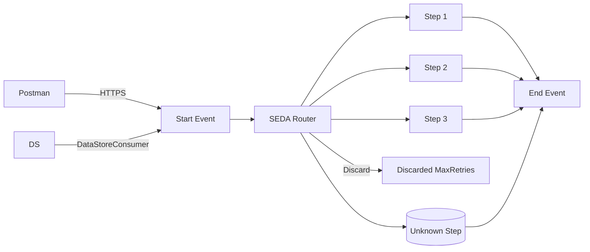

**iFlowId**: SEDA_Model_-_Single_DS_-_Restart_and_Discard_MMZ - **iFlowVersion**: 1.0.1

**Mermaid Diagram**

**BPMN Diagram**

**Functional Summary**
-   **Brief description of the iFlow**
    This iFlow simulates a scenario where messages are processed asynchronously through a SEDA (Staged Event-Driven Architecture) router. It retrieves messages from a DataStore, processes them in multiple steps (simulated), and handles potential exceptions and retries. It also allows for messages to be discarded after a certain number of retries.

-   **Involved systems with Adapters Type and Endpoint Type**
    -   Postman - HTTPS - Sender
    -   DS - DataStoreConsumer - Sender

-   **Key steps**
    1.  Receive messages from either HTTPS or DataStore.
    2.  Check the number of retries. If the `SAP_DataStoreRetries` header exceeds the configured `MaxRetries`, the message is discarded.
    3.  Route the message based on the `Step` header. Possible steps: Step1, Step2, Step3, Unknown.
    4.  Each step will prepare the headers and call local integration processes to simulate the processing.
    5.  Store each step messages in DataStore with DB Storage.
    6.  If an error occurs in any of the processing steps, a custom status will be set in the MPL (Message Processing Log), and the exception will be logged.

-   **Message transformation**
    -   The iFlow uses Enrichers to set headers (SAP\_Sender, SAP\_Receiver, SAP\_MessageType, Step) with constant values.
    -   Custom Status are added to MessageProcessingLog with values defined in Enrichers.
    -   "Prepare Step" enrichers adds values for the next step.

-   **Externalized parameters list, configured values and their descriptions**
    -   `MaxRetries`: 3 - Maximum number of retries before discarding a message.
    -   `SEDA_MAIN_QUEUE`: SEDA_MODEL_MMZ - Name of the SEDA queue.
    -   `Retention Threshold 4 Alerting`: 1 - Retention threshold for alerting.
    -   `Retry Interval`: 15 - Interval between retry attempts in seconds.
    -   `Number of Concurrent Processes`: 1 - Number of concurrent processes.
    -   `Data Store Name`: SEDA_MODEL_MMZ - Name of the Data Store.
    -   `RoleName`: ESBMessaging.send - Role required for sending messages.
    -   `Exponential Backoff`: 1 - Flag indicating whether exponential backoff is enabled.
    -   `Expiration Period`: 7 - Message expiration period in days.
    -   `Lock Timeout`: 10 - Lock timeout.
    -   `Maximum Retry Interval`: 1440 - Maximum retry interval.
    -   `Poll Interval`: 10 - Poll interval.

-   **DataStore / JMS Dependency**
    Yes

-   **Cloud Connector Dependency**
    Not Found

-   **Common Scripts Dependency**
    -   Log_Discarded_Message.groovy - Groovy_Logging_Scripts
    -   Log_Exception_Async.groovy - Groovy_Logging_Scripts

-   **ProcessDirect ComponentType Dependency**
    Not Found