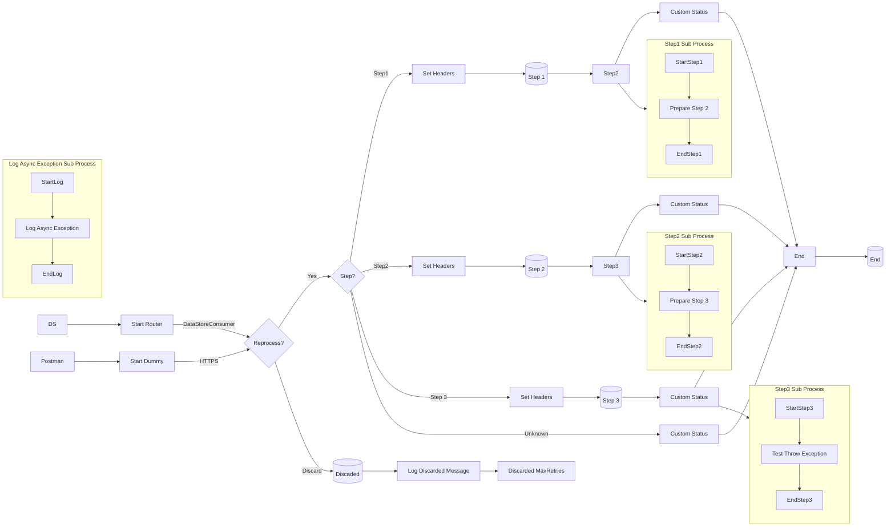

markdown
**iFlowId**: SEDA_Model_-_Single_DS_-_Restart_and_Discard_MMZ - **iFlowVersion**: 1.0.1

**Mermaid Diagram**

**BPMN Diagram**

**Functional Summary**
- **Brief description of the iFlow**
This iFlow simulates a scenario where messages are processed asynchronously through a SEDA queue. It involves retrieving messages from a Data Store, processing them through multiple steps, and storing the results back in the Data Store. The iFlow also includes error handling with retry mechanisms and discarding of messages exceeding the maximum retry limit.

- **Involved systems with Adapters Type and Endpoint Type**
    - Postman: HTTPS (EndpointSender)
    - DS: DataStoreConsumer (EndpointSender)

- **Key steps**
    1.  Receive message from HTTPS endpoint or DataStore.
    2.  Determine the next processing step using a router based on header 'Step'.
    3.  Persist the message in the Data Store at each step (Step1, Step2, Step3).
    4.  After each step call a Local Integration Process 'Step X', where X is the number of the step.
    5.  Set a custom status in Message Processing Log for each step with the suffix 'Completed'.
    6.  If the maximum retry count is exceeded, discard the message.

- **Message transformation**
    - Enrichment with custom status updates.
    - Setting headers (SAP_Sender, SAP_Receiver, SAP_MessageType, Step) at different stages.
    - Prepare Step sub processes add a hard coded message "StepXMessage" B64 encoded in a XML structure.

- **Externalized parameters list, configured values and their descriptions**
    - Data Store Name: SEDA_MODEL_MMZ (Name of the Data Store)
    - Expiration Period: 7 (Expiration period for Data Store entries in days)
    - Lock Timeout: 10 (Lock timeout for Data Store operations in seconds)
    - MaxRetries: 3 (Maximum number of retries for Data Store operations)
    - Maximum Retry Interval: 1440 (Maximum retry interval in minutes)
    - Number of Concurrent Processes: 1 (Number of concurrent processes)
    - Poll Interval: 10 (Poll interval for Data Store in seconds)
    - Retention Threshold 4 Alerting: 1 (Retention threshold for alerting)
    - Retry Interval: 15 (Retry interval for Data Store operations in seconds)
    - RoleName: ESBMessaging.send (Role name for HTTPS sender authentication)
    - Exponential Backoff: 1 (Enable exponential backoff)
    - SEDA_MAIN_QUEUE: SEDA_MODEL_MMZ (SEDA Queue Name)

- **DataStore / JMS Dependency**
Yes

- **Cloud Connector Dependency**
Not Found

- **Common Scripts Dependency**
    - Log_Exception_Async.groovy (scriptBundleId: Groovy_Logging_Scripts)
    - Log_Discarded_Message.groovy (scriptBundleId: Groovy_Logging_Scripts)

- **ProcessDirect ComponentType Dependency**
Not Found