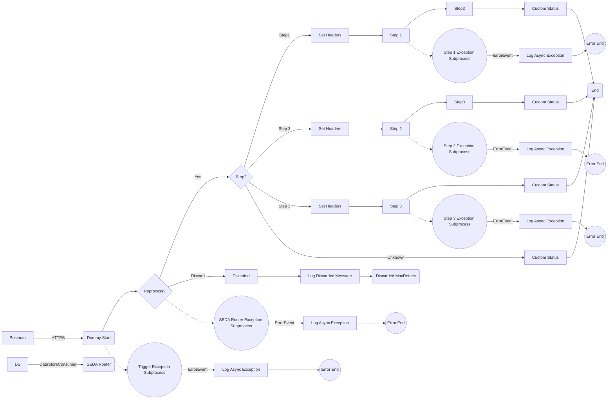

**iFlowId**: SEDA_Model_-_Single_DS_-_Restart_and_Discard_MMZ - **iFlowVersion**: 1.0.1

**Mermaid Diagram**

**BPMN Diagram**

**Functional Summary**
- **Brief description of the iFlow**
This iFlow demonstrates a SEDA (Staged Event-Driven Architecture) model with a single Data Store, designed to handle message restart and discard logic based on the number of retries. The flow retrieves messages from a Data Store, processes them through a series of steps, and stores them back into the Data Store. It includes exception handling and logging mechanisms.

- **Involved systems with Adapters Type and Endpoint Type**
    - Postman - HTTPS - Sender
    - DS - DataStoreConsumer - Sender

- **Key steps**
    1. Receive a message via HTTPS or DataStore.
    2. Determine if message needs to be reprocessed.
    3. Based on the "Step" header, route the message to different "Set Headers" steps.
    4. Call Step 1, Step 2, and Step 3 Local Integration Processes.
    5. Update DataStore.
    6. Set custom status and log completion for each step.
    7. Discard message after maximum retries are exceeded.
    8. Log any exceptions encountered during processing.

- **Message transformation**
    - The iFlow uses Enrichers to set headers like `SAP_Sender`, `SAP_Receiver`, `SAP_MessageType`, and `Step` with constant values, influencing routing.
    - Custom status messages are created using expressions that combine `SAP_MessageType` with step completion status.
    - Some content enrichers are used to set constant values, mainly for testing exception sub processes.

- **Externalized parameters list, configured values and their descriptions**
    - `MaxRetries`: 3 - Maximum number of retries before discarding the message.
    - `SEDA_MAIN_QUEUE`: SEDA_MODEL_MMZ - SEDA Queue Name
    - `Retention Threshold 4 Alerting`: 1 - Retention threshold for alerting purposes.
    - `Retry Interval`: 15 - Interval between retry attempts (in minutes/seconds - check unit).
    - `Number of Concurrent Processes`: 1 - Number of concurrent processes to allow.
    - `Data Store Name`: SEDA_MODEL_MMZ - Name of the Data Store used.
    - `RoleName`: ESBMessaging.send - Role required for sending messages.
    - `Exponential Backoff`: 1 - Exponential backoff enabled/disabled (boolean value).
    - `Expiration Period`: 7 - Expiration period for messages in the Data Store (in days).
    - `Lock Timeout`: 10 - Timeout for locking messages in the Data Store (in seconds).
    - `Maximum Retry Interval`: 1440 - Maximum interval for retry attempts.
    - `Poll Interval`: 10 - Interval for polling the Data Store (in minutes/seconds - check unit).

- **DataStore / JMS Dependency**
Yes

- **Cloud Connector Dependency**
Not Found

- **Common Scripts Dependency**
    - Log_Exception_Async.groovy - Groovy_Logging_Scripts
    - Log_Discarded_Message.groovy - Groovy_Logging_Scripts

- **ProcessDirect ComponentType Dependency**
Not Found