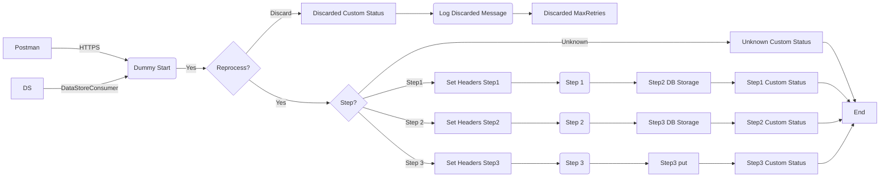

markdown
**iFlowId**: SEDA_Model_-_Single_DS_-_Restart_and_Discard_MMZ - **iFlowVersion**: 1.0.1

**Mermaid Diagram**

**BPMN Diagram**

**Functional Summary**
- **Brief description of the iFlow**
  This iFlow demonstrates a SEDA (Staged Event-Driven Architecture) pattern with a single Data Store, restart, and discard mechanism. Messages are processed through multiple steps (Step1, Step2, Step3) with exception handling and logging. It consumes messages from either an HTTPS endpoint or a DataStore and routes them based on the 'Step' header. If processing fails and the message exceeds the maximum retry attempts, it is discarded.

- **Involved systems with Adapters Type and Endpoint Type**
  - Postman: HTTPS (Sender)
  - DS: DataStoreConsumer (JDBC)

- **Key steps**
 1. Receive message from HTTPS endpoint or DataStore.
 2. Determine if the message should be reprocessed or discarded based on retry count (SAP_DataStoreRetries) against MaxRetries.
 3. Route message based on 'Step' header to Step1, Step2, or Step3.
 4. Each step updates the message status and stores it in a DataStore.
 5. Custom status is set at different steps of the process.
 6. Asynchronous exceptions are logged.
 7. Final message processing status is logged.
 8. If message exceeds max retries it is discarded and this is logged.

- **Message transformation**
  - The iFlow uses Enrichers to set message headers and custom status. The 'Step' header is used for routing. Also prepare Step 2 and Step 3 use enrichers to include message body.

- **Externalized parameters list, configured values and their descriptions**
  - MaxRetries: 3 - Maximum number of retries before discarding the message.
  - SEDA_MAIN_QUEUE: SEDA_MODEL_MMZ - JMS Queue Name.
  - Retention Threshold 4 Alerting: 1 - Retention Threshold Alerting.
  - Retry Interval: 15 - Retry interval in seconds.
  - Number of Concurrent Processes: 1 - Number of concurrent processes.
  - Data Store Name: SEDA_MODEL_MMZ - Name of the Data Store.
  - RoleName: ESBMessaging.send - Role required to access the HTTPS endpoint.
  - Exponential Backoff: 1 - Exponential backoff enabled/disabled.
  - Expiration Period: 7 - Expiration period in days.
  - Lock Timeout: 10 - Lock timeout.
  - Maximum Retry Interval: 1440 - Maximum Retry Interval.
  - Poll Interval: 10 - Poll interval in seconds.

- **DataStore / JMS Dependency**
  Yes

- **Cloud Connector Dependency**
  Not Found

- **Common Scripts Dependency**
  - Log_Exception_Async.groovy, scriptBundleId: Groovy_Logging_Scripts
  - Log_Discarded_Message.groovy, scriptBundleId: Groovy_Logging_Scripts

- **ProcessDirect ComponentType Dependency**
  Not Found