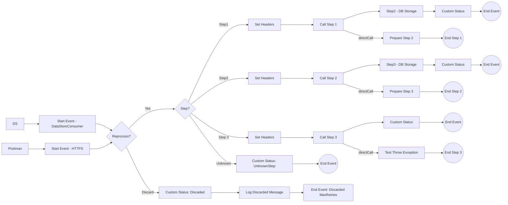

markdown
**iFlowId**: SEDA_Model_-_Single_DS_-_Restart_and_Discard_MMZ - **iFlowVersion**: 1.0.1

**Mermaid Diagram**

**BPMN Diagram**

**Functional Summary**
-   **Brief description of the iFlow**
    This iFlow demonstrates a SEDA (Staged Event-Driven Architecture) model with a single Data Store. It includes restart and discard mechanisms for messages that fail processing after multiple retries. It has an inbound HTTPS and DataStore adapter to start the process.

-   **Involved systems with Adapters Type and Endpoint Type**
    -   Postman: HTTPS (Sender)
    -   DS: DataStoreConsumer (Sender)

-   **Key steps**

    1.  The iFlow starts either via an HTTPS call or by consuming messages from a Data Store.
    2.  Based on the header "Step", the message is routed to Step1, Step2, or Step3 processes, using Enrichers, DB Storage and setting custom status on the Message Processing Log. If the step is unknown, the flow ends.
    3.  Before routing, the flow checks if the message has exceeded the maximum number of retries, if so the message is discarded and its information is logged.
    4.  Each step has its own sub-process to handle exceptions and logs the exception asynchronously.
    5.  After each step the custom status on the Message Processing Log is updated.

-   **Message transformation**

    -   "Set Headers" steps in the main process create headers "SAP_Sender", "SAP_Receiver", "SAP_MessageType", and "Step" with constant values.
    -   "Prepare Step 2" and "Prepare Step 3" within sub-processes "Step 1" and "Step 2" set the header Step with constant values.
    -   "Custom Status" steps set the "SAP_MessageProcessingLogCustomStatus" property in the Message Processing Log.

-   **Externalized parameters list, configured values and their descriptions**

    -   MaxRetries: 3 - Maximum number of retries before discarding a message.
    -   SEDA_MAIN_QUEUE: SEDA_MODEL_MMZ - Name of the SEDA queue.
    -   Retention Threshold 4 Alerting: 1 - Retention threshold for alerting.
    -   Retry Interval: 15 - Interval between retries in seconds.
    -   Number of Concurrent Processes: 1 - Number of concurrent processes.
    -   Data Store Name: SEDA_MODEL_MMZ - Name of the Data Store.
    -   RoleName: ESBMessaging.send - Role required for sending messages.
    -   Exponential Backoff: 1 - Flag indicating whether exponential backoff is enabled.
    -   Expiration Period: 7 - Expiration period for messages in days.
    -   Lock Timeout: 10 - Timeout for locking messages in seconds.
    -   Maximum Retry Interval: 1440 - Maximum retry interval in minutes.
    -   Poll Interval: 10 - Interval for polling the Data Store in seconds.

-   **DataStore / JMS Dependency**
    Yes

-   **Cloud Connector Dependency**
    Not Found

-   **Common Scripts Dependency**
    -   Log_Discarded_Message.groovy, scriptBundleId: Groovy_Logging_Scripts
    -   Log_Exception_Async.groovy, scriptBundleId: Groovy_Logging_Scripts

-   **ProcessDirect ComponentType Dependency**
    Not Found
